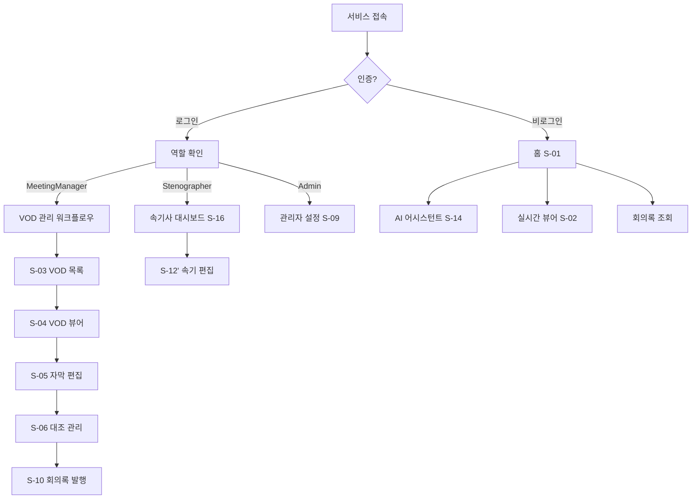

# User Flow (사용자 흐름도)

> 경기도의회 실시간 자막 서비스

---

## 1. 사용자 역할별 진입 흐름 (Phase 11)

### 1.1 일반직원 (Anonymous/비로그인) 흐름

```
서비스 접속 (비로그인)
    │
    ├─ 홈 대시보드 (S-01)
    │   ├─ 생중계 현황 대시보드 (AI 요약 포함)
    │   ├─ 우측 AI 채팅 패널 (Q&A)
    │   └─ 최근 회의록 목록
    │
    ├─ 실시간 뷰어 (S-02)
    │   └─ 실시간 자막 + AI 요약
    │
    ├─ AI 어시스턴트 (S-14 신규)
    │   └─ 회의록/의안/의원 데이터 기반 Q&A
    │
    └─ 통합검색 (S-08, 읽기전용)
        └─ 전체 회의록 검색 (편집 불가)
```

### 1.2 회의담당자 (MeetingManager) 흐름

```
로그인 (S-15 신규)
    │
    ▼
홈 대시보드 (S-01)
    │
    ├─ 사이드바 4개 모듈 활성화 (회의 선택 필수)
    │   ├─ VOD 등록 → S-03 VOD 목록 → S-04 VOD 뷰어
    │   ├─ 자막 편집 (S-05)
    │   ├─ 대조 관리 (S-06)
    │   └─ 회의록 작성 (S-10)
    │
    └─ 속기 편집 (S-12) → 속기사 전용 페이지
```

### 1.3 속기사 (Stenographer) 흐름

```
로그인 (S-15)
    │
    ▼
속기사 대시보드 (S-16 신규)
    ├─ 작업 대기열 (status: draft)
    │   ├─ 클릭 → 음성+STT 참고 + 텍스트 편집 (S-12')
    │   └─ 완료 → status: submitted
    │
    ├─ 진행중 편집 (status: submitted)
    │   └─ 음성 재청취 + 교정 가능
    │
    └─ 완료 목록 (status: approved)
        └─ 읽기 전용
```

### 1.4 전체 사용자 흐름 (단순화)



---

## 2. 메인 플로우

### 2.1 실시간 시청 플로우

```
[사용자] ─────────────────────────────────────────────────────────────
    │
    ▼
┌──────────────────────────────────────────────────────────────────┐
│  1. 서비스 접속                                                   │
│     └─ URL 접속 (인증 없음)                                       │
└──────────────────────────────────────────────────────────────────┘
    │
    ▼
┌──────────────────────────────────────────────────────────────────┐
│  2. 홈 대시보드 확인                                              │
│     ├─ 현재 실시간 회의 상태 확인                                 │
│     │   └─ [방송중] 표시 → "실시간 시청" 버튼 활성화             │
│     └─ 최근 VOD 목록 확인                                         │
└──────────────────────────────────────────────────────────────────┘
    │
    ▼
┌──────────────────────────────────────────────────────────────────┐
│  3. 실시간 시청 클릭                                              │
│     └─ 실시간 뷰어 화면으로 이동                                  │
└──────────────────────────────────────────────────────────────────┘
    │
    ▼
┌──────────────────────────────────────────────────────────────────┐
│  4. 실시간 뷰어                                                   │
│     ├─ 좌측 70%: 영상 플레이어 (HLS 스트림)                       │
│     ├─ 우측 30%: 자막 히스토리 (실시간 업데이트)                  │
│     │   └─ 새 자막 도착 시 자동 스크롤                            │
│     └─ 상단: 검색창                                               │
└──────────────────────────────────────────────────────────────────┘
    │
    ├─── [검색] ───────────────────────────────────────────────────
    │    │
    │    ▼
    │ ┌──────────────────────────────────────────────────────────┐
    │ │  5a. 키워드 검색                                          │
    │ │      ├─ 검색어 입력                                       │
    │ │      ├─ 자막 히스토리에서 키워드 하이라이트               │
    │ │      └─ 하이라이트된 자막 클릭 → 해당 시점 이동           │
    │ └──────────────────────────────────────────────────────────┘
    │
    └─── [자막 클릭] ─────────────────────────────────────────────
         │
         ▼
      ┌──────────────────────────────────────────────────────────┐
      │  5b. 시점 이동                                            │
      │      └─ 자막 항목 클릭 → 영상 해당 시점으로 이동          │
      └──────────────────────────────────────────────────────────┘
```

### 2.2 VOD 시청 플로우

```
[사용자] ─────────────────────────────────────────────────────────────
    │
    ▼
┌──────────────────────────────────────────────────────────────────┐
│  1. 홈 대시보드 접속                                              │
│     └─ VOD 목록 확인                                              │
└──────────────────────────────────────────────────────────────────┘
    │
    ├─── [기존 VOD 선택] ──────────────────────────────────────────
    │    │
    │    ▼
    │ ┌──────────────────────────────────────────────────────────┐
    │ │  2a. VOD 목록에서 선택                                    │
    │ │      ├─ 회의 날짜, 제목, 재생 시간 확인                   │
    │ │      └─ 클릭하여 VOD 뷰어로 이동                          │
    │ └──────────────────────────────────────────────────────────┘
    │
    └─── [새 VOD 등록] ────────────────────────────────────────────
         │
         ▼
      ┌──────────────────────────────────────────────────────────┐
      │  2b. VOD URL 등록                                         │
      │      ├─ "VOD 등록" 버튼 클릭                              │
      │      ├─ 모달: KMS VOD URL 입력 (단일 필드)                │
      │      ├─ URL에서 제목/날짜/MP4 경로 자동 추출              │
      │      ├─ POST /api/meetings/from-url → 회의 생성           │
      │      └─ 자막 생성은 별도 STT 시작 필요                    │                       │
      └──────────────────────────────────────────────────────────┘
    │
    ▼
┌──────────────────────────────────────────────────────────────────┐
│  3. VOD 뷰어                                                      │
│     ├─ 좌측 70%: 영상 플레이어 (MP4)                              │
│     │   └─ 재생/일시정지, 배속 조절, 타임라인 시크                │
│     ├─ 우측 30%: 자막 히스토리 (전체 로드됨)                      │
│     │   └─ 현재 재생 위치에 따라 자막 하이라이트                  │
│     └─ 상단: 검색창                                               │
└──────────────────────────────────────────────────────────────────┘
    │
    ▼
┌──────────────────────────────────────────────────────────────────┐
│  4. 검색 & 탐색                                                   │
│     ├─ 키워드 검색 → 하이라이트                                   │
│     └─ 자막 클릭 → 해당 시점으로 이동                             │
└──────────────────────────────────────────────────────────────────┘
```

---

## 3. 화면별 상세 흐름

### 3.1 홈 대시보드

```
┌─────────────────────────────────────────────────────────────────┐
│  홈 대시보드                                                     │
├─────────────────────────────────────────────────────────────────┤
│                                                                  │
│  ┌───────────────────────────────────────────────────────────┐  │
│  │  🔴 실시간 회의                                            │  │
│  │  ───────────────────────────────────────────────────────  │  │
│  │  제11대 제396회 임시회 본회의                              │  │
│  │  상태: 방송중 | 시작: 10:00                                │  │
│  │                                                            │  │
│  │  [실시간 시청하기] 버튼                                    │  │
│  └───────────────────────────────────────────────────────────┘  │
│                                                                  │
│  ┌───────────────────────────────────────────────────────────┐  │
│  │  📁 최근 VOD                             [전체보기] [등록] │  │
│  │  ───────────────────────────────────────────────────────  │  │
│  │  • 2026-02-04 | 예산결산특별위원회 | 2:30:15 | ✅ 자막완료 │  │
│  │  • 2026-02-03 | 기획재정위원회    | 1:45:30 | ✅ 자막완료 │  │
│  │  • 2026-02-02 | 본회의            | 3:20:00 | ⏳ 자막생성중│  │
│  └───────────────────────────────────────────────────────────┘  │
│                                                                  │
└─────────────────────────────────────────────────────────────────┘

[User Actions]
1. "실시간 시청하기" 클릭 → 실시간 뷰어
2. VOD 항목 클릭 → VOD 뷰어
3. "전체보기" 클릭 → VOD 목록
4. "등록" 클릭 → VOD 등록 모달
```

### 3.2 실시간 뷰어

```
┌─────────────────────────────────────────────────────────────────┐
│  🔴 실시간 | 제11대 제396회 임시회 본회의          [🔍 검색]    │
├───────────────────────────────────────────┬─────────────────────┤
│                                           │  자막 히스토리       │
│                                           │  ─────────────────  │
│           [영상 플레이어]                 │  10:15:30           │
│                                           │  의장님, 제가...     │
│            HLS 스트리밍                   │  ─────────────────  │
│                                           │  10:15:45           │
│           (70% 너비)                      │  예산안에 대해서...  │
│                                           │  ─────────────────  │
│                                           │  10:16:02           │
│                                           │  추경 예산이...      │  ← 최신
│                                           │  ─────────────────  │
│                                           │        (30% 너비)   │
├───────────────────────────────────────────┴─────────────────────┤
│  ⏯️ 라이브    🔊 볼륨                                            │
└─────────────────────────────────────────────────────────────────┘

[User Actions]
1. 자막 항목 클릭 → 해당 시점으로 영상 이동
2. 검색창 입력 → 키워드 하이라이트
3. 검색 결과(하이라이트된 자막) 클릭 → 시점 이동
```

### 3.3 VOD 뷰어

```
┌─────────────────────────────────────────────────────────────────┐
│  📁 VOD | 2026-02-04 예산결산특별위원회             [🔍 검색]    │
├───────────────────────────────────────────┬─────────────────────┤
│                                           │  자막 히스토리       │
│                                           │  ─────────────────  │
│           [영상 플레이어]                 │  00:05:30           │
│                                           │  위원장님, ...       │
│            MP4 재생                       │  ─────────────────  │
│                                           │▶ 00:05:45  ← 현재   │
│           (70% 너비)                      │  예산 심의를...      │
│                                           │  ─────────────────  │
│                                           │  00:06:02           │
│                                           │  작년 대비...        │
│                                           │  ─────────────────  │
│                                           │        (30% 너비)   │
├───────────────────────────────────────────┴─────────────────────┤
│  ◀◀ ⏯️ ▶▶ | 00:05:45 / 2:30:15 | 🔊 | 1x [1x 1.5x 2x]          │
│  [────────●──────────────────────────────────────────] 타임라인  │
└─────────────────────────────────────────────────────────────────┘

[User Actions]
1. 자막 항목 클릭 → 해당 시점으로 영상 이동
2. 타임라인 드래그 → 시점 이동
3. 배속 조절 → 1x, 1.5x, 2x
4. 검색 → 키워드 하이라이트
```

---

## 4. 예외 흐름

### 4.1 실시간 회의 없음

```
홈 대시보드
    │
    └─ 실시간 회의 영역
        └─ "현재 진행 중인 회의가 없습니다."
           "다음 회의 일정: 2026-02-06 10:00"
```

### 4.2 VOD 자막 생성 중

```
VOD 목록
    │
    └─ VOD 항목
        └─ 상태: "자막 생성 중... (60%)"
           [클릭 시] → 자막 없이 영상만 재생 가능
```

### 4.3 검색 결과 없음

```
검색창에 "XYZ123" 입력
    │
    └─ 자막 히스토리
        └─ "검색 결과가 없습니다."
           [검색어 지우기] 버튼
```

### 4.4 네트워크 오류

```
실시간 뷰어
    │
    └─ WebSocket 연결 끊김
        └─ 토스트: "연결이 끊어졌습니다. 재연결 중..."
           [자동 재연결 시도]
           [수동 재연결] 버튼
```

---

## 5. 추가 화면 플로우 (Phase 5~9)

### 5.1 자막 편집 플로우

```
[사용자] ──────────────────────────────────────────────────────────
    │
    ▼
┌──────────────────────────────────────────────────────────────────┐
│  1. VOD 뷰어에서 "자막 편집" 클릭 → /vod/{id}/edit              │
└──────────────────────────────────────────────────────────────────┘
    │
    ▼
┌──────────────────────────────────────────────────────────────────┐
│  2. 자막 편집 화면                                               │
│     ├─ 좌: 영상 플레이어 (시점 동기화)                           │
│     ├─ 우: 편집 가능한 자막 목록 (시간/화자/텍스트)             │
│     ├─ 교정 도구: 용어 점검 | AI 문법 검사 | PII 마스킹         │
│     └─ "저장" 버튼 → 변경된 자막만 PATCH                        │
└──────────────────────────────────────────────────────────────────┘
    │
    ├─── [용어 점검] → 불일치 항목 하이라이트 → "일괄 교정"
    ├─── [AI 문법 검사] → 맞춤법 오류 표시 → "적용"
    └─── [변경 이력] → 수정 히스토리 모달
```

### 5.2 대조 관리 플로우

```
[사용자] ──────────────────────────────────────────────────────────
    │
    ▼
┌──────────────────────────────────────────────────────────────────┐
│  1. 사이드바 "대조관리" 또는 워크플로우 네비 → /vod/{id}/verify  │
└──────────────────────────────────────────────────────────────────┘
    │
    ▼
┌──────────────────────────────────────────────────────────────────┐
│  2. 대조 진행률 확인 (verified / flagged / unverified 비율)      │
│     ├─ 검토 대기열 (신뢰도 낮은 순)                              │
│     ├─ 개별 승인/플래그 → verification_status 변경               │
│     ├─ 일괄 처리 → 선택된 자막 한번에 처리                       │
│     └─ AI 요약 생성 → 전체 요약/안건별 요약/핵심결정/후속조치    │
└──────────────────────────────────────────────────────────────────┘
```

### 5.3 의안 관리 플로우

```
[사용자] ──────────────────────────────────────────────────────────
    │
    ▼ 사이드바 "의안관리"
┌──────────────────────────────────────────────────────────────────┐
│  1. 의안 목록 (/bills) — 위원회/상태 필터 + 검색                 │
│     ├─ 의안 등록 → 의안번호/제목/제안자/위원회 입력              │
│     └─ 의안 클릭 → 상세 + 관련 회의 구간 목록                   │
│                        └─ 구간 클릭 → VOD 뷰어 해당 시점         │
└──────────────────────────────────────────────────────────────────┘
```

### 5.4 통합 검색 플로우

```
[사용자] ──────────────────────────────────────────────────────────
    │
    ▼ 사이드바 "통합검색" 또는 상단 헤더 검색 버튼
┌──────────────────────────────────────────────────────────────────┐
│  1. 검색 페이지 (/search)                                        │
│     ├─ 키워드 입력 + 날짜 범위/화자 필터                         │
│     ├─ 전체 회의에서 자막 검색 → 하이라이트 결과 표시            │
│     └─ 결과 클릭 → /vod/{id}?t={start_time} VOD 뷰어 시점 이동  │
└──────────────────────────────────────────────────────────────────┘
```

### 5.5 관리자 플로우

```
[사용자] ──────────────────────────────────────────────────────────
    │
    ▼ 사이드바 "시스템관리"
┌──────────────────────────────────────────────────────────────────┐
│  1. 관리자 페이지 (/admin) — 시스템 관리 대시보드                 │
│     ├─ 시스템 점검: 외부 API 상태 (OpenAI, Deepgram 등)          │
│     ├─ 전체 현황: 회의수, 자막수, 총시간, 평균 신뢰도            │
│     ├─ 월별 통계: 월별 회의 수 + 재생 시간 차트                  │
│     ├─ 리포트 내보내기: 기간별 마크다운 리포트                    │
│     └─ 하위: 용어사전 관리 (/admin/dictionary)                                         │
└──────────────────────────────────────────────────────────────────┘
```

### 5.6 회의록 작성 플로우

```
[사용자] ──────────────────────────────────────────────────────────
    │
    ▼ 사이드바 "회의록작성" 또는 워크플로우 네비
┌──────────────────────────────────────────────────────────────────┐
│  1. 회의록 작성 (/vod/{id}/minutes)                              │
│     ├─ 안건별 자막 분류 (화자별 연속 발언 병합)                  │
│     ├─ AI 요약 생성/재생성 (GPT-5-mini)                          │
│     │   └─ 전체 요약 + 안건별 요약 + 핵심 결정 + 후속 조치       │
│     ├─ 부록 파일 업로드/다운로드 (안건별 첨부)                   │
│     ├─ 회의록 발행 상태 관리 (draft → reviewing → final)         │
│     └─ 내보내기 (마크다운/SRT/JSON/공식회의록 4형식)             │
└──────────────────────────────────────────────────────────────────┘
```

### 5.7 화자 관리 플로우

```
[사용자] ──────────────────────────────────────────────────────────
    │
    ▼ 사이드바 "화자관리"
┌──────────────────────────────────────────────────────────────────┐
│  1. 화자 관리 (/vod/{id}/speaker)                                │
│     ├─ 영상 플레이어 + 화자별 타임라인 (색상 구분)               │
│     ├─ 화자 발언 구간 클릭 → 영상 해당 시점 이동                │
│     ├─ AI 화자 제안 → 화자 라벨에서 실제 이름 매칭              │
│     │   └─ 전략적 샘플링 + 의원 DB 크로스 매칭                   │
│     ├─ CouncilorPicker → 의원 DB에서 직접 화자 지정              │
│     ├─ 화자 병합 → 동일인 화자 라벨 통합                         │
│     └─ 영상 클립 추출 → 화자 발언 구간 MP4 다운로드              │
└──────────────────────────────────────────────────────────────────┘
```

### 5.8 속기 관리 플로우

```
[사용자] ──────────────────────────────────────────────────────────
    │
    ▼ 사이드바 "교정/편집관리" 하위
┌──────────────────────────────────────────────────────────────────┐
│  1. 속기 관리 (/vod/{id}/stenography)                            │
│     ├─ 속기록 목록 (작성자, 상태, 생성일)                        │
│     ├─ 속기록 등록 (텍스트 직접 입력 또는 파일 업로드)           │
│     ├─ 상태 관리: draft → submitted → approved                   │
│     ├─ STT 대조 → 속기 원문 vs STT 자막 나란히 비교             │
│     └─ 속기록 삭제 (DB + 파일 동시 삭제)                         │
└──────────────────────────────────────────────────────────────────┘
```

### 5.9 용어사전 관리 플로우

```
[사용자] ──────────────────────────────────────────────────────────
    │
    ▼ 사이드바 "시스템관리" 하위
┌──────────────────────────────────────────────────────────────────┐
│  1. 용어사전 관리 (/admin/dictionary)                            │
│     ├─ 카테고리 필터 (전체/의원명/의회용어/일반/사용자교정)      │
│     ├─ 사전 목록 테이블 (잘못된표현, 올바른표현, 카테고리, 등록일)│
│     ├─ 항목 추가 → wrong_text + correct_text + category 입력     │
│     └─ 항목 삭제 → 확인 후 삭제                                  │
└──────────────────────────────────────────────────────────────────┘
```

### 5.10 플랫폼 셸 네비게이션 (Phase 9)

```
┌─────────────────────────────────────────────────────────────────┐
│ [≡] 경기도의회 자막 > 회의관리 > VOD 목록 > 회의 제목   [🔍]   │
├──────────┬──────────────────────────────────────────────────────┤
│ 사이드바  │  메인 콘텐츠                                        │
│──────────│                                                      │
│ ▼ 회의관리│  (각 페이지 렌더링)                                  │
│   대시보드 │                                                      │
│   실시간  │                                                      │
│   회의목록│                                                      │
│──────────│                                                      │
│ ▼ 회의록  │  [워크플로우: 회의정보 → 편집 → 검증]               │
│ ▼ 화자관리│                                                      │
│ ▼ 대조관리│                                                      │
│ ▼ 교정편집│                                                      │
│──────────│                                                      │
│ ▼ 의안관리│                                                      │
│   통합검색│                                                      │
│──────────│                                                      │
│   시스템  │                                                      │
└──────────┴──────────────────────────────────────────────────────┘
```

---

## 6. 화면 전환 매트릭스

| From \ To | 홈 | 실시간 | VOD목록 | VOD뷰어 | 자막편집 | 대조관리 | 의안 | 검색 | 관리자 | 회의록 | 화자 | 속기 | 용어사전 |
|-----------|-----|--------|---------|---------|---------|---------|------|------|--------|--------|------|------|----------|
| **홈**        | -   | ✓      | ✓       | ✓       |         |         |      |      |        |        |      |      |          |
| **실시간**    | ✓   | -      |         |         |         |         |      |      |        |        |      |      |          |
| **VOD목록**   | ✓   |        | -       | ✓       |         |         |      |      |        |        |      |      |          |
| **VOD뷰어**   | ✓   |        | ✓       | -       | ✓       | ✓       |      |      |        | ✓      | ✓    | ✓    |          |
| **자막편집**  | ✓   |        |         | ✓       | -       | ✓       |      |      |        | ✓      | ✓    | ✓    |          |
| **대조관리**  | ✓   |        |         | ✓       | ✓       | -       |      |      |        | ✓      | ✓    | ✓    |          |
| **의안관리**  | ✓   |        |         | ✓       |         |         | -    |      |        |        |      |      |          |
| **통합검색**  | ✓   |        |         | ✓       |         |         |      | -    |        |        |      |      |          |
| **관리자**    | ✓   |        |         |         |         |         |      |      | -      |        |      |      | ✓        |
| **회의록**    | ✓   |        |         | ✓       | ✓       | ✓       |      |      |        | -      | ✓    | ✓    |          |
| **화자관리**  | ✓   |        |         | ✓       | ✓       | ✓       |      |      |        | ✓      | -    | ✓    |          |
| **속기관리**  | ✓   |        |         | ✓       | ✓       | ✓       |      |      |        | ✓      | ✓    | -    |          |
| **용어사전**  | ✓   |        |         |         |         |         |      |      | ✓      |        |      |      | -        |

> 모든 화면에서 사이드바를 통해 다른 모듈로 이동 가능 (Phase 9 PlatformLayout)

---

## 6. 반응형 동작

### 모바일 (< 768px)

```
┌─────────────────────────────────┐
│  🔴 실시간 | 본회의    [🔍]     │
├─────────────────────────────────┤
│                                 │
│      [영상 플레이어]            │
│                                 │
│        (100% 너비)              │
│                                 │
├─────────────────────────────────┤
│  자막 히스토리                  │
│  ─────────────────────────────  │
│  10:15:30 | 의장님, 제가...     │
│  10:15:45 | 예산안에 대해서...  │
│        (스크롤 가능)            │
└─────────────────────────────────┘
```

- 영상 100% → 자막 아래 배치
- 검색창 아이콘화
