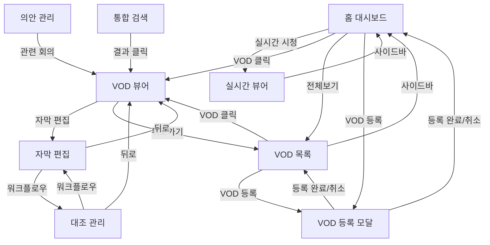

# 화면 명세 (06-screens.md)

> 경기도의회 실시간 자막 서비스

---

## 개요

| 항목 | 내용 |
|------|------|
| **서비스명** | 경기도의회 실시간 자막 서비스 |
| **핵심 기능** | 실시간 자막, 키워드 검색, VOD 자막, 채널 시스템, 자막 교정, 의안 관리, 대조 관리, AI 요약, 플랫폼 셸 UI |
| **총 화면 수** | 16개 (S-01~S-16) + 2 모달 (M-01, M-02) |
| **인증 필요 화면** | 0개 현재 (관리자 화면 인증 예정) |
| **레이아웃** | PlatformLayout (사이드바 + 상단 헤더 + 브레드크럼) |

> 최종 갱신: 2026-03-19 (Phase 11 개선 추가)

---

## 화면 목록

### 1. 홈 대시보드 (/)

| 항목 | 내용 |
|------|------|
| **화면 ID** | S-01 |
| **연결 기능** | 진입점, FEAT-1, FEAT-3 |
| **인증 필요** | No |
| **진입점** | URL 직접 접속 |

**주요 요소:**
- **네비게이션**: PlatformLayout 사이드바 + 상단 헤더 (브레드크럼: 홈 > 회의관리 > 대시보드)
- **실시간 회의 카드**: 현재 실시간 회의 상태 표시
  - 방송중: 🔴 Live 배지 + "실시간 시청하기" 버튼
  - 방송전: 다음 회의 일정 표시
  - 방송 없음: "예정된 회의가 없습니다"
- **최근 VOD 목록**: 최근 5개 VOD
  - 날짜, 제목, 재생시간, 자막 상태 (✅완료 / ⏳생성중)
- **VOD 전체보기 버튼**: VOD 목록 페이지로 이동
- **VOD 등록 버튼**: VOD 등록 모달 열기

**사용자 액션:**
- "실시간 시청하기" 클릭 → 실시간 뷰어 (S-02)
- VOD 항목 클릭 → VOD 뷰어 (S-04)
- "전체보기" 클릭 → VOD 목록 (S-03)
- "등록" 클릭 → VOD 등록 모달

**이동 가능 화면:**
- → 실시간 뷰어 (방송중일 때)
- → VOD 목록 (전체보기)
- → VOD 뷰어 (VOD 클릭)

---

### 2. 실시간 뷰어 (/live)

| 항목 | 내용 |
|------|------|
| **화면 ID** | S-02 |
| **연결 기능** | FEAT-1: 실시간 자막, FEAT-2: 키워드 검색 |
| **인증 필요** | No |
| **진입점** | 홈 "실시간 시청하기" 버튼 |

**주요 요소:**
- **네비게이션**: PlatformLayout 사이드바 + 상단 헤더 (브레드크럼: 홈 > 회의관리 > 실시간 시청)
- **채널 선택기**: 18개 채널 드롭다운 (방송 상태 표시, SSE 구독)
- **영상 플레이어 (70%)**: HLS 스트리밍 영상
  - HLS.js로 재생
  - 볼륨 컨트롤
- **자막 히스토리 패널 (30%)**:
  - 시간 + 자막 텍스트 (화자는 색상으로 구분)
  - 실시간 업데이트 (WebSocket)
  - 새 자막 도착 시 자동 스크롤
  - 자막 클릭 → 해당 시점 이동
- **검색 기능**:
  - 검색어 입력 시 키워드 하이라이트 (노란색)
  - 검색 결과(하이라이트된 자막) 클릭 → 시점 이동

**사용자 액션:**
- 사이드바 메뉴 → 다른 모듈로 이동
- 채널 선택 → 해당 채널 HLS 스트림 전환
- 검색어 입력 → 자막 하이라이트
- 자막 항목 클릭 → 영상 해당 시점 이동
- 하이라이트된 자막 클릭 → 영상 해당 시점 이동

**이동 가능 화면:**
- → 사이드바를 통해 모든 모듈로 이동 가능

**빈 상태:**
- 자막 없음: "자막을 불러오는 중..." 스피너

**에러 상태:**
- WebSocket 연결 끊김: "연결이 끊어졌습니다. 재연결 중..." 토스트
- 스트림 로드 실패: "영상을 불러올 수 없습니다. 새로고침해주세요."

---

### 3. VOD 목록 (/vod)

| 항목 | 내용 |
|------|------|
| **화면 ID** | S-03 |
| **연결 기능** | FEAT-3: VOD 자막 |
| **인증 필요** | No |
| **진입점** | 홈 "전체보기" 버튼 |

**주요 요소:**
- **네비게이션**: PlatformLayout 사이드바 + 상단 헤더 (브레드크럼: 홈 > 회의관리 > VOD 목록)
- **VOD 목록 테이블/카드**:
  - 날짜: 회의 날짜
  - 제목: 회의 제목
  - 재생시간: 총 시간 (HH:MM:SS)
  - 자막 상태: ✅ 자막완료 / ⏳ 자막생성중 (진행률%) / ❌ 자막없음
  - 클릭 시 VOD 뷰어로 이동
- **페이지네이션**: 페이지당 10개

**사용자 액션:**
- 사이드바 메뉴 → 다른 모듈로 이동
- VOD 항목 클릭 → VOD 뷰어 (S-04)
- "VOD 등록" 클릭 → VOD 등록 모달

**이동 가능 화면:**
- → 사이드바를 통해 모든 모듈로 이동 가능
- → VOD 뷰어 (VOD 클릭)

**빈 상태:**
- VOD 없음: "등록된 VOD가 없습니다. 첫 번째 VOD를 등록해보세요!" + [등록하기] 버튼

---

### 4. VOD 뷰어 (/vod/:id)

| 항목 | 내용 |
|------|------|
| **화면 ID** | S-04 |
| **연결 기능** | FEAT-3: VOD 자막, FEAT-2: 키워드 검색 |
| **인증 필요** | No |
| **진입점** | 홈 VOD 클릭, VOD 목록 VOD 클릭 |

**주요 요소:**
- **네비게이션**: PlatformLayout 사이드바 + 상단 헤더 (브레드크럼: 홈 > 회의관리 > {회의 제목})
- **워크플로우 네비**: MeetingWorkflowNav (회의정보 → 편집 → 검증)
- **영상 플레이어 (70%)**: MP4 재생
  - 재생/일시정지
  - 타임라인 시크
  - 배속 조절 (1x, 1.5x, 2x)
  - 볼륨 컨트롤
  - 현재 시간 / 전체 시간
- **자막 히스토리 패널 (30%)**:
  - 시간 + 자막 텍스트
  - 전체 자막 로드됨
  - 현재 재생 위치 자막 하이라이트 (파란 테두리)
  - 재생 위치에 따라 자동 스크롤
  - 자막 클릭 → 해당 시점 이동
- **검색 기능**: 실시간 뷰어와 동일

**사용자 액션:**
- 사이드바 메뉴 → 다른 모듈로 이동
- 워크플로우 네비 → 자막 편집 (S-05) / 대조 관리 (S-06) 전환
- 재생/일시정지 → 영상 제어
- 타임라인 드래그 → 시점 이동
- 배속 버튼 → 재생 속도 변경
- 자막 항목 클릭 → 영상 해당 시점 이동
- 검색어 입력 → 자막 하이라이트

**이동 가능 화면:**
- → 사이드바를 통해 모든 모듈로 이동 가능
- → 워크플로우 네비로 편집/검증 전환

**빈 상태:**
- 자막 생성 중: "자막을 생성하고 있습니다... (60%)" 프로그레스바
- 자막 없음: "자막이 아직 생성되지 않았습니다." + [자막 생성하기] 버튼

**에러 상태:**
- 영상 로드 실패: "영상을 불러올 수 없습니다."
- VOD 없음: "존재하지 않는 VOD입니다." → 홈으로 버튼

---

### 5. 자막 편집 (/vod/:id/edit) — Phase 5~6B

| 항목 | 내용 |
|------|------|
| **화면 ID** | S-05 |
| **연결 기능** | 자막 수동 교정, 용어 점검, AI 문법 검사, PII 마스킹 |
| **인증 필요** | No |
| **진입점** | VOD 뷰어 "자막 편집" 버튼, 사이드바 "교정/편집관리" |

**주요 요소:**
- **네비게이션**: PlatformLayout 사이드바 + 상단 헤더 (브레드크럼: 홈 > 교정/편집관리 > {회의 제목})
- **워크플로우 네비**: MeetingWorkflowNav (회의정보 → 편집 → 검증)
- **좌측: 영상 플레이어** (Mp4Player 재사용)
- **우측: 편집 가능한 자막 목록**
  - 각 자막 행: 시간 | 화자(드롭다운) | 텍스트(textarea)
  - 현재 재생 위치 → 해당 자막 하이라이트
  - 자막 클릭 → 해당 시점으로 이동
- **교정 도구 툴바 (ProofreadingToolbar)**:
  - 용어 점검 버튼 → 용어 불일치 하이라이트
  - AI 문법 검사 → 맞춤법/띄어쓰기 오류 표시
  - 일괄 교정 적용 버튼
- **PII 마스킹 버튼**: 개인정보 감지 및 마스킹
- **변경 이력 모달 (SubtitleHistoryModal)**: 자막 수정 이력 조회
- **회의 정보 패널 (MeetingInfoPanel)**: 제목, 위원회, 안건
- **저장 버튼**: 변경된 항목만 PATCH 요청
- **변경 감지**: 저장 전 이탈 시 경고

**사용자 액션:**
- 자막 텍스트 수정 → 인라인 편집
- "용어 점검" → 용어 불일치 항목 표시
- "AI 문법 검사" → 맞춤법 오류 하이라이트
- "일괄 교정" → 검출된 오류 일괄 수정
- "PII 마스킹" → 개인정보 자동 감지 및 마스킹
- "변경 이력" → 수정 이력 모달
- "저장" → 변경된 자막 일괄 저장

**이동 가능 화면:**
- → VOD 뷰어 (뒤로가기)
- → 대조 관리 (워크플로우 네비게이션)

---

### 6. 대조 관리 (/vod/:id/verify) — Phase 7

| 항목 | 내용 |
|------|------|
| **화면 ID** | S-06 |
| **연결 기능** | 자막 대조(QA), 검토 대기열, 일괄 처리 |
| **인증 필요** | No |
| **진입점** | 사이드바 "대조관리", 워크플로우 네비게이션 |

**주요 요소:**
- **네비게이션**: PlatformLayout 사이드바 + 상단 헤더 (브레드크럼: 홈 > 대조관리 > {회의 제목})
- **워크플로우 네비**: MeetingWorkflowNav (회의정보 → 편집 → 검증)
- **대조 진행률**: verified / flagged / unverified 카운트 + 진행률 바
- **검토 대기열**: 신뢰도 낮은 순 정렬
  - 각 자막: 시간 | 텍스트 | 신뢰도 | 화자
  - 상태 배지: unverified / verified / flagged
- **개별 대조 처리**: 승인(verified) / 플래그(flagged) 버튼
- **일괄 대조 처리**: 선택한 자막 일괄 승인/플래그
- **AI 요약 패널 (MeetingSummaryPanel)**:
  - AI 요약 생성/재생성 버튼
  - 전체 요약, 안건별 요약, 핵심 결정, 후속 조치 표시

**사용자 액션:**
- 자막 항목 승인 → verification_status: verified
- 자막 항목 플래그 → verification_status: flagged
- "일괄 처리" → 선택된 자막 일괄 상태 변경
- "AI 요약 생성" → OpenAI GPT-5-mini 요약 생성
- "요약 재생성" → 기존 요약 삭제 후 재생성

---

### 7. 의안 관리 (/bills) — Phase 5

| 항목 | 내용 |
|------|------|
| **화면 ID** | S-07 |
| **연결 기능** | 의안 CRUD, 회의 연결, 상태 필터 |
| **인증 필요** | No |
| **진입점** | 사이드바 "의안관리" |

**주요 요소:**
- **의안 목록 테이블**: 의안번호, 제목, 제안자, 위원회, 상태, 제안일
- **필터**: 위원회, 상태 (접수/심사/의결/공포), 키워드 검색
- **의안 등록 폼**: 의안번호, 제목, 제안자, 위원회, 상태, 제안일
- **의안-회의 연결**: 의안 상세에서 관련 회의 연결
- **관련 회의 목록**: 연결된 회의의 해당 자막 구간 표시

**사용자 액션:**
- 의안 등록/수정
- 위원회/상태 필터링
- 의안 상세 → 관련 회의 구간 확인
- 회의 구간 클릭 → VOD 뷰어 해당 시점 이동

---

### 8. 통합 검색 (/search) — Phase 5

| 항목 | 내용 |
|------|------|
| **화면 ID** | S-08 |
| **연결 기능** | 전체 회의 통합 자막 검색, 날짜/화자 필터 |
| **인증 필요** | No |
| **진입점** | 사이드바 "통합검색", 상단 헤더 검색 버튼 |

**주요 요소:**
- **검색 입력**: 키워드 입력 + 즉시 검색
- **필터**: 날짜 범위 (date_from, date_to), 화자
- **검색 결과 목록**:
  - 회의명 + 날짜
  - 자막 텍스트 (키워드 하이라이트)
  - 시간 표시
- **페이지네이션**: limit, offset

**사용자 액션:**
- 키워드 검색 → 전체 회의에서 자막 검색
- 날짜/화자 필터 적용
- 결과 클릭 → VOD 뷰어 해당 시점 이동 (`/vod/{id}?t={start_time}`)

---

### 9. 관리자 (/admin)

| 항목 | 내용 |
|------|------|
| **화면 ID** | S-09 |
| **연결 기능** | 시스템 점검, 외부 API 상태, 통계 대시보드 |
| **인증 필요** | 예정 |
| **진입점** | 사이드바 "시스템관리" |

**주요 요소:**
- **네비게이션**: PlatformLayout 사이드바 + 상단 헤더 (브레드크럼: 홈 > 시스템관리)
- **시스템 점검**: 외부 API 상태 (OpenAI, Deepgram, Supabase, KMS, HLS 등)
- **전체 현황**: 총 회의, 자막 수, 총 시간, 평균 신뢰도
- **월별 통계**: 월별 회의 수 + 재생 시간 차트
- **리포트 내보내기**: 기간별 마크다운 리포트 생성
- **하위 페이지**: 용어사전 관리 (/admin/dictionary)

---

### 10. 회의록 작성 (/vod/:id/minutes)

| 항목 | 내용 |
|------|------|
| **화면 ID** | S-10 |
| **연결 기능** | 안건별 자막 분류, AI 요약, 부록파일, 회의록 발행 |
| **인증 필요** | No |
| **진입점** | 사이드바 "회의록작성" 또는 워크플로우 네비 |

**주요 요소:**
- **네비게이션**: PlatformLayout 사이드바 + 상단 헤더 (브레드크럼: 홈 > 회의록작성 > {회의 제목})
- **안건 목록**: 안건별 자막 그룹 (화자별 연속 발언 병합)
- **AI 요약 패널**: 전체 요약, 안건별 요약, 핵심 결정, 후속 조치
- **부록 파일**: 안건별 파일 업로드/다운로드/삭제 (50MB 제한)
- **회의록 발행**: 상태 관리 (draft → reviewing → final)
- **내보내기**: 마크다운, SRT, JSON, 공식 회의록 4형식

**사용자 액션:**
- 안건 선택 → 해당 구간 자막 표시
- AI 요약 생성/재생성 → GPT-5-mini 기반 요약
- 부록 파일 업로드/삭제 → 안건별 첨부파일 관리
- 회의록 발행 상태 변경 → draft/reviewing/final
- 내보내기 → 4가지 형식으로 다운로드

---

### 11. 화자 관리 (/vod/:id/speaker)

| 항목 | 내용 |
|------|------|
| **화면 ID** | S-11 |
| **연결 기능** | 화자별 타임라인, AI 화자 제안, 화자 병합, 영상 클립 |
| **인증 필요** | No |
| **진입점** | 사이드바 "화자관리" |

**주요 요소:**
- **네비게이션**: PlatformLayout 사이드바 + 상단 헤더 (브레드크럼: 홈 > 화자관리 > {회의 제목})
- **영상 플레이어**: MP4 재생 + 재생 컨트롤
- **화자 타임라인**: 화자별 총 발언시간, 발언 횟수, 발언 구간
- **화자별 색상**: 10가지 컬러 팔레트로 화자 구분
- **AI 화자 제안**: 화자 라벨 → 실제 이름 매칭 (GPT + 의원 DB)
- **화자 병합**: 동일인 화자 라벨 통합
- **의원 선택**: CouncilorPicker로 의원 DB에서 선택
- **영상 클립**: 화자 발언 구간 영상 추출 (ffmpeg)

**사용자 액션:**
- 화자 발언 구간 클릭 → 해당 시점 영상 이동
- AI 화자 제안 → 화자 이름 자동 매칭 + 적용
- 화자 병합 → 소스 화자 → 타겟 화자 병합
- 영상 클립 추출 → MP4 다운로드

---

### 12. 속기 관리 (/vod/:id/stenography)

| 항목 | 내용 |
|------|------|
| **화면 ID** | S-12 |
| **연결 기능** | 속기록 CRUD, STT 대조, 상태 관리 |
| **인증 필요** | No |
| **진입점** | 사이드바 "교정/편집관리" 하위 |

**주요 요소:**
- **네비게이션**: PlatformLayout 사이드바 + 상단 헤더 (브레드크럼: 홈 > 교정/편집관리 > 속기관리)
- **속기록 목록**: 작성자, 상태, 생성일 표시
- **속기록 등록**: 텍스트 직접 입력 또는 파일 업로드 (50MB 제한)
- **상태 관리**: draft → submitted → approved
- **STT 대조**: 속기록 vs STT 자막 나란히 비교 모달

**사용자 액션:**
- 속기록 등록 (텍스트/파일) → 속기 원문 저장
- 속기록 수정 → 내용/상태/작성자 변경
- STT 대조 → 속기 라인 vs 자막 비교 모달
- 속기록 삭제 → DB + 파일 삭제

---

### 13. 용어사전 관리 (/admin/dictionary)

| 항목 | 내용 |
|------|------|
| **화면 ID** | S-13 |
| **연결 기능** | 사전 CRUD, 카테고리 필터 |
| **인증 필요** | 예정 |
| **진입점** | 사이드바 "시스템관리" 하위 |

**주요 요소:**
- **네비게이션**: PlatformLayout 사이드바 + 상단 헤더 (브레드크럼: 홈 > 시스템관리 > 용어사전)
- **카테고리 필터**: 전체, 의원명, 의회용어, 일반, 사용자 교정
- **사전 목록 테이블**: 잘못된 표현, 올바른 표현, 카테고리, 등록일
- **항목 추가 폼**: 잘못된 표현 + 올바른 표현 + 카테고리 선택
- **삭제 기능**: 개별 항목 삭제 (확인 후)

**사용자 액션:**
- 카테고리 선택 → 필터링
- 새 항목 추가 → wrong_text/correct_text/category 입력
- 항목 삭제 → 확인 후 삭제

---

## 모달

### M-01. VOD 등록 모달

| 항목 | 내용 |
|------|------|
| **모달 ID** | M-01 |
| **트리거** | 홈/VOD목록 "VOD 등록" 버튼 |

**주요 요소:**
- **안내 문구**: "KMS URL을 입력하면 제목, 날짜, 영상 정보가 자동으로 추출됩니다."
- **URL 입력**: "VOD URL" (필수, 단일 필드)
  - placeholder: `http://kms.ggc.go.kr/caster/player/vodViewer.do?midx=...`
  - KMS URL 입력 시 메타데이터(제목, 날짜, MP4 경로) 자동 추출
- **취소 버튼**: 모달 닫기
- **등록 버튼**: VOD 등록 (로딩 중 "등록 중..." 표시)

**유효성 검사:**
- URL: 필수, URL 형식
- 에러 시 입력 필드 하단에 빨간색 에러 메시지 표시

**API**: `POST /api/meetings/from-url` — URL만으로 등록, 메타데이터 자동 추출

**액션:**
- 등록 성공 → 모달 닫기, 목록 갱신 (자막 생성은 별도 `POST /api/meetings/{id}/stt`로 시작)
- 등록 실패 (422) → "URL에서 영상 정보를 추출할 수 없습니다."
- 중복 등록 (409) → "이미 등록된 VOD입니다."

---

## 화면 흐름도



---

## 화면 연결 매트릭스

| From \ To | 홈 | 실시간 | VOD목록 | VOD뷰어 | 자막편집 | 대조관리 | 의안 | 검색 | 회의록 | 화자 | 속기 | 사전 | 관리자 |
|-----------|-----|--------|---------|---------|---------|---------|------|------|--------|------|------|------|--------|
| **홈**        | -   | ✓      | ✓       | ✓       |         |         |      |      |        |      |      |      |        |
| **실시간**    | ✓   | -      |         |         |         |         |      |      |        |      |      |      |        |
| **VOD목록**   | ✓   |        | -       | ✓       |         |         |      |      |        |      |      |      |        |
| **VOD뷰어**   | ✓   |        | ✓       | -       | ✓       | ✓       |      |      | ✓      | ✓    |      |      |        |
| **자막편집**  | ✓   |        |         | ✓       | -       | ✓       |      |      |        |      | ✓    |      |        |
| **대조관리**  | ✓   |        |         | ✓       | ✓       | -       |      |      |        |      |      |      |        |
| **의안관리**  | ✓   |        |         | ✓       |         |         | -    |      |        |      |      |      |        |
| **통합검색**  | ✓   |        |         | ✓       |         |         |      | -    |        |      |      |      |        |
| **회의록작성** | ✓   |        |         | ✓       |         |         |      |      | -      |      |      |      |        |
| **화자관리**  | ✓   |        |         | ✓       |         |         |      |      |        | -    |      |      |        |
| **속기관리**  | ✓   |        |         |         | ✓       |         |      |      |        |      | -    |      |        |
| **용어사전**  | ✓   |        |         |         |         |         |      |      |        |      |      | -    |        |
| **관리자**    | ✓   |        |         |         |         |         |      |      |        |      |      |      | -      |

> 모든 화면에서 사이드바를 통해 홈/실시간/VOD목록/의안/검색/관리자로 이동 가능
> VOD 뷰어/자막 편집/대조 관리는 MeetingWorkflowNav로 워크플로우 내 이동

---

## 14. 로그인 (S-15) — Phase 11

| 항목 | 내용 |
|------|------|
| **화면 ID** | S-15 |
| **경로** | `/login` |
| **연결 기능** | 권한 체계, 인증 |
| **인증 필요** | No (로그인 전 진입) |

**주요 요소:**
- **로그인 폼**
  - Username 입력 필드
  - Password 입력 필드
  - "로그인" 버튼
  - "비로그인으로 계속" 링크 (홈으로)
- **역할 표시**
  - 로그인 후 역할별 메뉴 다르게 표시
  - 비로그인: Anonymous 역할 (제한된 기능)

---

## 15. 속기사 대시보드 (S-16) — Phase 11

| 항목 | 내용 |
|------|------|
| **화면 ID** | S-16 |
| **경로** | `/stenography` |
| **연결 기능** | 속기 편집, 텍스트 중심 편집 |
| **인증 필요** | Yes (Stenographer 역할) |

**주요 요소:**
- **작업 대기열 (status: draft)**
  - 회의 제목, 속기사, 등록일
  - 클릭 → S-12' 속기 편집기 진입
- **진행중 편집 (status: submitted)**
  - 재청취 + 최종 교정
  - 완료 후 status: approved로 전환
- **완료 목록 (status: approved)**
  - 읽기 전용, 다운로드 가능

---

## 16. AI 어시스턴트 (S-14) — Phase 11

| 항목 | 내용 |
|------|------|
| **화면 ID** | S-14 |
| **경로** | `/ai` |
| **연결 기능** | AI Q&A, RAG 기반 검색 |
| **인증 필요** | No (비로그인 가능, 로그인 시 이력 저장) |

**주요 요소:**
- **대화 입력 필드**
  - 질문 입력 + "질문" 버튼
  - 히스토리 자동 저장
- **대화 목록**
  - 사용자 질문 (우측 정렬, 파란색)
  - AI 응답 (좌측 정렬, 회색)
  - 참고 문서 링크 (회의ID, 의안ID)
- **세션 관리** (로그인 시만)
  - 이전 대화 기록 로드
  - 세션별 대화 분류

---

## 17. AI 요약 모달 (M-02) — Phase 11

| 항목 | 내용 |
|------|------|
| **모달 ID** | M-02 |
| **트리거** | 생중계/VOD "AI 요약" 버튼 또는 홈 S-01 카드 |
| **모달 크기** | 600x400px (중형) |

**주요 요소:**
- **요약 텍스트**
  - 전체 요약 (3~5줄)
- **빠른 액션**
  - "전체 회의록 보기" 버튼 → S-10 또는 S-14
  - "재생성" 버튼 (새로운 AI 요약)
  - "닫기" 버튼

---

## 공통 요소

### 플랫폼 셸 레이아웃 (PlatformLayout) — Phase 9

```
┌──────────┬──────────────────────────────────────────────────────┐
│ 사이드바  │  [≡] 브레드크럼: 홈 > 회의관리 > VOD 목록    [🔍]   │
│ (256px)  ├──────────────────────────────────────────────────────┤
│──────────│                                                      │
│ 회의관리 │  메인 콘텐츠 영역                                    │
│ 회의록   │                                                      │
│ 화자관리 │  (각 페이지 렌더링)                                  │
│ 대조관리 │                                                      │
│ 교정편집 │                                                      │
│ 의안관리 │                                                      │
│ 통합검색 │                                                      │
│ 시스템   │                                                      │
└──────────┴──────────────────────────────────────────────────────┘
```

- **사이드바**: 8개 모듈 아코디언, 접기/펼치기 (SidebarContext)
- **상단 헤더 (48px)**: 브레드크럼 + 모바일 햄버거 + 검색 바로가기
- **브레드크럼**: 경로 기반 자동 생성, 동적 회의 제목 지원
- **워크플로우 네비**: `/vod/[id]/*` 경로에서 단계 표시

> Note: 개별 `<Header>` 컴포넌트는 레거시이며, PlatformLayout으로 대체됨 (Phase 9)

### 토스트 (Toast)

- 위치: 우하단
- 자동 사라짐: 3초
- 종류: 성공 (초록), 에러 (빨강), 정보 (파랑)

---

## 반응형 브레이크포인트

| 디바이스 | 너비 | 주요 변화 |
|----------|------|----------|
| 모바일 | < 768px | 영상 100%, 자막 아래 배치, 검색 아이콘화 |
| 태블릿 | 768px ~ 1024px | 60%/40% 분할 |
| 데스크톱 | > 1024px | 70%/30% 분할 |

---

## 다음 단계

이 문서를 기반으로:

1. **`/screen-spec`** 실행 → 각 화면별 상세 YAML 명세 생성
2. **`/tasks-generator`** 실행 → 화면 단위 태스크 생성

```
06-screens.md (이 문서)
    ↓
/screen-spec (선택)
    ↓
specs/screens/*.yaml
    ↓
/tasks-generator
    ↓
TASKS.md
```
