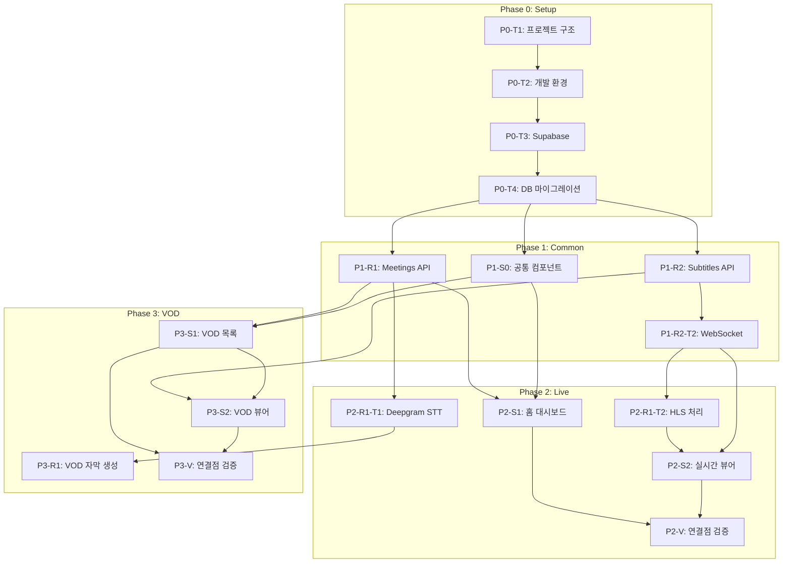

# TASKS.md - 경기도의회 실시간 자막 서비스

> Domain-Guarded 화면 단위 태스크 구조
> 생성일: 2026-02-05

---

## 개요

| 항목 | 내용 |
|------|------|
| 총 Phase | 10개 (P0 ~ P9) — **전체 완료** |
| 총 태스크 | 약 60개 |
| Backend Resources | meetings, subtitles, channels, bills, summaries 등 |
| Frontend Screens | 13개 (S-01~S-13) + 1 모달 |
| TDD 적용 | Phase 1+ 전체 |
| 테스트 현황 | Frontend 415/415, Backend 309/309 통과 |

> 최종 갱신: 2026-03-18

---

## Phase 0: 프로젝트 초기화

> **Git Worktree**: 불필요 (main 브랜치에서 직접 작업)

### [x] P0-T1: 프로젝트 구조 생성
- **담당**: setup
- **작업**:
  - Next.js 14 프로젝트 생성 (frontend/)
  - FastAPI 프로젝트 생성 (backend/)
  - 모노레포 구조 설정
- **파일**:
  ```
  /
  ├── frontend/          # Next.js 14
  │   ├── src/
  │   │   ├── app/       # App Router
  │   │   ├── components/
  │   │   ├── hooks/
  │   │   ├── lib/
  │   │   └── types/
  │   ├── package.json
  │   └── tsconfig.json
  ├── backend/           # FastAPI
  │   ├── app/
  │   │   ├── api/
  │   │   ├── core/
  │   │   ├── models/
  │   │   └── services/
  │   ├── tests/
  │   ├── requirements.txt
  │   └── pyproject.toml
  └── docker-compose.yml
  ```
- **완료 조건**: `npm run dev` (frontend), `uvicorn app.main:app` (backend) 실행 가능

### [x] P0-T2: 개발 환경 설정
- **담당**: setup
- **작업**:
  - ESLint, Prettier 설정 (frontend)
  - Ruff, Black 설정 (backend)
  - TypeScript strict 모드
  - Python type hints
- **파일**: `.eslintrc.js`, `.prettierrc`, `pyproject.toml`
- **완료 조건**: `npm run lint`, `ruff check` 통과

### [x] P0-T3: Supabase 연동
- **담당**: setup
- **작업**:
  - Supabase 프로젝트 생성
  - 환경변수 설정 (.env.local, .env)
  - Supabase 클라이언트 설정
- **파일**: `backend/app/core/database.py`, `frontend/src/lib/supabase.ts`
- **완료 조건**: DB 연결 테스트 통과

### [x] P0-T4: 데이터베이스 마이그레이션
- **담당**: setup
- **작업**:
  - meetings 테이블 생성
  - subtitles 테이블 생성
  - councilors 테이블 생성
  - dictionary 테이블 생성
  - 인덱스 생성
  - Realtime 활성화 (subtitles)
- **파일**: `backend/migrations/001_initial.sql`
- **SQL 참조**: `docs/planning/04-database-design.md`
- **완료 조건**: 모든 테이블 생성, `supabase db push` 성공

---

## Phase 1: 공통 인프라

> **Git Worktree**: `worktree/phase-1-common`
> **TDD**: RED → GREEN → REFACTOR

### P1-R1: Meetings Resource (Backend)

#### [x] P1-R1-T1: Meetings API 구현
- **담당**: backend-specialist
- **리소스**: meetings
- **엔드포인트**:
  | Method | Path | 설명 |
  |--------|------|------|
  | GET | /api/meetings | 회의 목록 조회 |
  | GET | /api/meetings/live | 실시간 회의 조회 |
  | GET | /api/meetings/{id} | 회의 상세 조회 |
  | POST | /api/meetings | VOD 회의 등록 |
- **필드**: id, title, meeting_date, stream_url, vod_url, status, duration_seconds, created_at, updated_at
- **파일**:
  - `backend/tests/api/test_meetings.py` (먼저)
  - `backend/app/api/meetings.py`
  - `backend/app/models/meeting.py`
  - `backend/app/schemas/meeting.py`
- **TDD**:
  1. RED: 테스트 작성 → 실패 확인
  2. GREEN: API 구현 → 테스트 통과
  3. REFACTOR: 코드 정리
- **완료 조건**: `pytest tests/api/test_meetings.py` 통과

### P1-R2: Subtitles Resource (Backend)

#### [x] P1-R2-T1: Subtitles API 구현
- **담당**: backend-specialist
- **리소스**: subtitles
- **엔드포인트**:
  | Method | Path | 설명 |
  |--------|------|------|
  | GET | /api/meetings/{meeting_id}/subtitles | 자막 목록 |
  | GET | /api/meetings/{meeting_id}/subtitles/search | 자막 검색 |
- **필드**: id, meeting_id, start_time, end_time, text, speaker, confidence, created_at
- **파일**:
  - `backend/tests/api/test_subtitles.py`
  - `backend/app/api/subtitles.py`
  - `backend/app/models/subtitle.py`
  - `backend/app/schemas/subtitle.py`
- **TDD**: RED → GREEN → REFACTOR
- **완료 조건**: `pytest tests/api/test_subtitles.py` 통과

#### [x] P1-R2-T2: WebSocket 실시간 자막
- **담당**: backend-specialist
- **리소스**: subtitles (realtime)
- **엔드포인트**: WS /ws/meetings/{meeting_id}/subtitles
- **이벤트**:
  - `subtitle_created`: 새 자막 브로드캐스트
- **파일**:
  - `backend/tests/websocket/test_subtitle_ws.py`
  - `backend/app/api/websocket.py`
- **완료 조건**: WebSocket 연결 및 메시지 수신 테스트 통과

### P1-S0: 공통 레이아웃 (Frontend)

#### [x] P1-S0-T1: 공통 컴포넌트 구현
- **담당**: frontend-specialist
- **컴포넌트**:
  | 컴포넌트 | 파일 | 기능 |
  |---------|------|------|
  | Header | `components/Header.tsx` | 로고, 제목, 검색창, 배지 |
  | Toast | `components/Toast.tsx` | 알림 토스트 |
  | Badge | `components/Badge.tsx` | Live/VOD/상태 배지 |
  | SubtitleItem | `components/SubtitleItem.tsx` | 자막 아이템 |
- **스타일 참조**: `docs/planning/05-design-system.md`
- **파일**:
  - `frontend/src/components/__tests__/Header.test.tsx`
  - `frontend/src/components/Header.tsx`
  - (각 컴포넌트 동일 패턴)
- **TDD**: 컴포넌트 테스트 먼저 작성
- **완료 조건**: `npm test -- --coverage` 80%+ 커버리지

#### [x] P1-S0-T2: 레이아웃 설정
- **담당**: frontend-specialist
- **작업**:
  - RootLayout 설정
  - Pretendard 폰트 적용
  - TailwindCSS 테마 설정
  - 반응형 브레이크포인트 적용
- **파일**:
  - `frontend/src/app/layout.tsx`
  - `frontend/tailwind.config.js`
  - `frontend/src/app/globals.css`
- **완료 조건**: 폰트 로드, 테마 색상 적용 확인

---

## Phase 2: 핵심 기능 - 실시간 자막

> **Git Worktree**: `worktree/phase-2-live`
> **TDD**: RED → GREEN → REFACTOR

### P2-R1: Deepgram STT 통합 (Backend)

#### [x] P2-R1-T1: Deepgram STT 서비스 구현
- **담당**: backend-specialist
- **작업**:
  - Deepgram Nova-3 Streaming WebSocket 클라이언트
  - 오디오 청크 → 텍스트 변환 (실시간 스트리밍)
  - 의원 명단 키워드 적용
  - 용어 사전 후처리
- **파일**:
  - `backend/tests/services/test_deepgram_stt.py`
  - `backend/app/services/deepgram_stt.py`
  - `backend/app/services/dictionary.py`
- **환경변수**: `DEEPGRAM_API_KEY`
- **완료 조건**: Deepgram STT 호출 및 후처리 테스트 통과

#### [x] P2-R1-T2: HLS 스트림 처리
- **담당**: backend-specialist
- **작업**:
  - HLS 마스터/미디어 플레이리스트 2단계 파싱
  - TS 세그먼트 다운로드
  - Deepgram Streaming WSS 전송 (3개 동시 태스크: sender/receiver/keepalive)
  - 실시간 자막 생성 파이프라인
- **파일**:
  - `backend/tests/services/test_stream_processor.py`
  - `backend/app/services/stream_processor.py`
- **완료 조건**: HLS → Deepgram → 자막 변환 E2E 테스트 통과

### P2-S1: 홈 대시보드 화면

#### [x] P2-S1-T1: 홈 UI 구현
- **담당**: frontend-specialist
- **화면**: S-01 (/)
- **컴포넌트**:
  | 컴포넌트 | 기능 |
  |---------|------|
  | LiveMeetingCard | 실시간 회의 상태 카드 |
  | RecentVodList | 최근 VOD 목록 |
  | VodActions | 전체보기/등록 버튼 |
- **데이터 요구**: meetings (live, vods)
- **파일**:
  - `frontend/src/app/page.test.tsx`
  - `frontend/src/app/page.tsx`
  - `frontend/src/components/LiveMeetingCard.tsx`
  - `frontend/src/components/RecentVodList.tsx`
- **TDD**: RED → GREEN → REFACTOR
- **데모**: http://localhost:3000/
- **완료 조건**: 컴포넌트 렌더링 + API 연동 테스트 통과

#### [x] P2-S1-T2: 홈 API 연동
- **담당**: frontend-specialist
- **작업**:
  - `/api/meetings/live` 호출
  - `/api/meetings?status=processing,ended&limit=5` 호출
  - SWR 캐싱/재검증
- **파일**:
  - `frontend/src/hooks/useLiveMeeting.ts`
  - `frontend/src/hooks/useRecentVods.ts`
- **완료 조건**: API 연동 테스트 통과

### P2-S2: 실시간 뷰어 화면

#### [x] P2-S2-T1: 실시간 뷰어 UI 구현
- **담당**: frontend-specialist
- **화면**: S-02 (/live)
- **컴포넌트**:
  | 컴포넌트 | 기능 |
  |---------|------|
  | HlsPlayer | HLS 스트리밍 재생 (HLS.js) |
  | SubtitlePanel | 자막 히스토리 패널 |
  | SearchInput | 키워드 검색 |
- **레이아웃**: 70% 영상 / 30% 자막
- **파일**:
  - `frontend/src/app/live/page.test.tsx`
  - `frontend/src/app/live/page.tsx`
  - `frontend/src/components/HlsPlayer.tsx`
  - `frontend/src/components/SubtitlePanel.tsx`
- **완료 조건**: 레이아웃 렌더링 + HLS 재생 테스트 통과

#### [x] P2-S2-T2: WebSocket 실시간 자막 연동
- **담당**: frontend-specialist
- **작업**:
  - WebSocket 연결 (`/ws/meetings/{id}/subtitles`)
  - `subtitle_created` 이벤트 처리
  - 자동 스크롤
  - 재연결 로직
- **파일**:
  - `frontend/src/hooks/useSubtitleWebSocket.ts`
- **완료 조건**: 실시간 자막 수신 + 표시 테스트 통과

#### [x] P2-S2-T3: 키워드 검색 기능
- **담당**: frontend-specialist
- **작업**:
  - 검색어 입력 → 자막 하이라이트 (노란색)
  - 하이라이트된 자막 클릭 → 시점 이동
- **파일**:
  - `frontend/src/hooks/useSubtitleSearch.ts`
  - `frontend/src/utils/highlight.ts`
- **완료 조건**: 검색 + 하이라이트 + 시점 이동 테스트 통과

### [x] P2-V: Phase 2 연결점 검증
- **담당**: test-specialist
- **검증 항목**:
  - [ ] `/` → `/live` 네비게이션 (방송중일 때만)
  - [ ] meetings 리소스 필드 커버리지
  - [ ] subtitles 리소스 필드 커버리지
  - [ ] WebSocket 연결/재연결
  - [ ] HLS 스트림 재생
- **파일**: `frontend/e2e/phase2-live.spec.ts`
- **완료 조건**: E2E 테스트 통과

---

## Phase 3: 핵심 기능 - VOD 자막

> **Git Worktree**: `worktree/phase-3-vod`
> **TDD**: RED → GREEN → REFACTOR

### P3-R1: VOD 자막 생성 (Backend)

#### [x] P3-R1-T1: VOD 자막 생성 서비스
- **담당**: backend-specialist
- **작업**:
  - MP4 직접 Deepgram에 스트리밍 (ffmpeg 미사용)
  - Deepgram REST API 배치 처리 (diarize=true)
  - 화자 그룹핑 + 자막 DB 저장
  - 백그라운드 태스크 (asyncio)
- **파일**:
  - `backend/tests/services/test_vod_processor.py`
  - `backend/app/services/vod_processor.py`
  - `backend/app/tasks/subtitle_generation.py`
- **완료 조건**: VOD → 자막 생성 E2E 테스트 통과

### P3-S1: VOD 목록 화면

#### [x] P3-S1-T1: VOD 목록 UI 구현
- **담당**: frontend-specialist
- **화면**: S-03 (/vod)
- **컴포넌트**:
  | 컴포넌트 | 기능 |
  |---------|------|
  | VodTable | VOD 목록 테이블 |
  | SubtitleStatusBadge | 자막 상태 배지 |
  | Pagination | 페이지네이션 |
- **파일**:
  - `frontend/src/app/vod/page.test.tsx`
  - `frontend/src/app/vod/page.tsx`
  - `frontend/src/components/VodTable.tsx`
- **완료 조건**: 테이블 렌더링 + 페이지네이션 테스트 통과

#### [x] P3-S1-T2: VOD 등록 모달
- **담당**: frontend-specialist
- **화면**: M-01
- **컴포넌트**: VodRegisterModal
- **폼 필드**: title, meeting_date, vod_url
- **유효성 검사**:
  - 제목: 필수, 2자 이상
  - 날짜: 필수
  - URL: 필수, URL 형식
- **파일**:
  - `frontend/src/components/__tests__/VodRegisterModal.test.tsx`
  - `frontend/src/components/VodRegisterModal.tsx`
- **완료 조건**: 폼 유효성 검사 + API 연동 테스트 통과

### P3-S2: VOD 뷰어 화면

#### [x] P3-S2-T1: VOD 뷰어 UI 구현
- **담당**: frontend-specialist
- **화면**: S-04 (/vod/:id)
- **컴포넌트**:
  | 컴포넌트 | 기능 |
  |---------|------|
  | Mp4Player | MP4 재생 (배속 지원) |
  | SubtitlePanel | 전체 자막 표시 |
  | VideoControls | 재생/일시정지, 타임라인, 배속 |
- **파일**:
  - `frontend/src/app/vod/[id]/page.test.tsx`
  - `frontend/src/app/vod/[id]/page.tsx`
  - `frontend/src/components/Mp4Player.tsx`
- **완료 조건**: 영상 재생 + 자막 표시 테스트 통과

#### [x] P3-S2-T2: 자막 동기화 기능
- **담당**: frontend-specialist
- **작업**:
  - 영상 시간 → 현재 자막 하이라이트
  - 자막 패널 자동 스크롤
  - 자막 클릭 → 영상 시점 이동
- **파일**:
  - `frontend/src/hooks/useSubtitleSync.ts`
- **완료 조건**: 자막 동기화 + 시점 이동 테스트 통과

### [x] P3-V: Phase 3 연결점 검증
- **담당**: test-specialist
- **검증 항목**:
  - [x] `/` → `/vod` 네비게이션
  - [x] `/vod` → `/vod/:id` 네비게이션
  - [x] VOD 등록 모달 동작
  - [x] 자막 상태 배지 표시
  - [x] 자막 동기화
- **파일**: `frontend/e2e/phase3-vod.spec.ts`
- **완료 조건**: E2E 테스트 통과

---

## 의존성 그래프



---

## 병렬 실행 가능 태스크

| Phase | 병렬 가능 태스크 |
|-------|----------------|
| P0 | P0-T1 ~ P0-T4 (순차) |
| P1 | P1-R1 ∥ P1-R2 ∥ P1-S0 |
| P2 | P2-R1 (순차) → P2-S1 ∥ P2-S2 |
| P3 | P3-R1 → P3-S1 ∥ P3-S2 |

---

## 성공 기준

| 메트릭 | 목표 |
|--------|------|
| 자막 지연 | < 5초 |
| 의회 용어/의원 이름 정확도 | > 90% |
| 테스트 커버리지 (Backend) | > 80% |
| 테스트 커버리지 (Frontend) | > 80% |
| E2E 테스트 통과율 | 100% |

---

---

## Phase 4: 채널 시스템 + STT 파이프라인 + VOD 등록

> **상태**: ✅ 완료

### [x] P4-T1: 18개 HLS 채널 정적 설정
- `backend/app/core/channels.py` — 채널 ID/이름/스트림 URL 정의

### [x] P4-T2: 채널 목록/상태/STT 제어 API
- `backend/app/api/channels.py` — GET /api/channels, POST /api/channels/{id}/stt/start|stop

### [x] P4-T3: 채널 방송 상태 조회 서비스
- `backend/app/services/channel_status.py` — 경기도의회 API 호출, SSE 스트림

### [x] P4-T4: Deepgram Streaming STT 서비스
- `backend/app/services/deepgram_stt.py` — Nova-3 Streaming WebSocket
- `backend/app/services/channel_stt.py` — 채널별 STT 관리 (sender/receiver/keepalive)

### [x] P4-T5: HLS 2단계 파싱
- `backend/app/services/hls_parser.py` — 마스터 → 미디어 → TS 세그먼트

### [x] P4-T6: VOD 등록 (KMS URL 자동 변환)
- `backend/app/services/kms_vod_resolver.py` — KMS VOD URL → MP4 변환
- `backend/app/services/vod_stt_service.py` — VOD STT 파이프라인 (ffmpeg 미사용)

### [x] P4-T7: 프론트엔드 채널 시스템
- `frontend/src/components/ChannelSelector.tsx` — 18개 채널 선택 UI
- `frontend/src/hooks/useChannels.ts`, `useChannelStatus.ts`

---

## Phase 5: 화자식별 + 자막교정 + 통합검색 + 의안관리 + 회의록 내보내기

> **상태**: ✅ 완료 (상세 태스크: `08-feature-tasks.md` 참조)

### [x] P5-F1: 화자 식별 (Speaker Diarization)
- Deepgram diarize=true 활성화, 화자 그룹핑 유틸리티, 화자별 색상 표시

### [x] P5-F2: 자막 수동 교정 (Subtitle Editor)
- PATCH API, 자막 편집 페이지 (`/vod/[id]/edit`), 변경 감지

### [x] P5-F3: 통합검색 강화 (Global Search)
- GET /api/search, 통합 검색 페이지 (`/search`)

### [x] P5-F4: 의안-회의록 연결 (Bill Linking)
- bills/bill_mentions 테이블, CRUD API, 의안 관리 페이지 (`/bills`)

### [x] P5-F5: 공식 회의록 형식 (Official Export)
- 4형식 내보내기 (markdown/srt/json/official)

---

## Phase 6A: 회의관리 확장

> **상태**: ✅ 완료

### [x] P6A-T1: 안건 관리 (meeting_agendas 테이블)
### [x] P6A-T2: 참석자 관리
### [x] P6A-T3: 발행 워크플로우 (TranscriptStatusBadge)
### [x] P6A-T4: 자막 변경 이력 추적 (subtitle_history 테이블, SubtitleHistoryModal)
### [x] P6A-T5: 회의 정보 패널 (MeetingInfoPanel)

---

## Phase 6B: 용어점검 + AI 문장검사 + PII 마스킹 + 교정 도구 UI

> **상태**: ✅ 완료

### [x] P6B-T1: 용어 점검 API (terminology_checker.py)
### [x] P6B-T2: AI 문법 검사 API (grammar_checker.py, GPT-5-mini)
### [x] P6B-T3: PII 마스킹 서비스 (pii_masking.py)
### [x] P6B-T4: 교정 도구 UI (ProofreadingToolbar, PiiMaskButton)

---

## Phase 7: 대조관리 (Verification QA) + AI 회의 요약

> **상태**: ✅ 완료

### [x] P7-T1: verification_status 컬럼 추가 (subtitles 테이블)
### [x] P7-T2: 대조관리 API (verify/stats, verify/queue, verify/batch)
### [x] P7-T3: 대조관리 서비스 (verification_service.py)
### [x] P7-T4: 대조관리 프론트엔드 (`/vod/[id]/verify`)
### [x] P7-T5: AI 요약 서비스 (summary_service.py, GPT-5-mini)
### [x] P7-T6: AI 요약 API (POST/GET/DELETE /api/meetings/{id}/summary)
### [x] P7-T7: AI 요약 UI (MeetingSummaryPanel)

---

## Phase 8: Railway 안정성 + OpenAI 실시간 자막 교정

> **상태**: ✅ 완료

### [x] P8-T1: Self-ping 헬스체크 (5분 간격, Railway App Sleeping 방지)
### [x] P8-T2: AutoSttManager.stop_all() (활성 채널 STT 일괄 중지)
### [x] P8-T3: SubtitleCorrectorService (OpenAI GPT-5-mini 배치 큐 교정)
- 3개 자막씩 10초 간격 배치 처리
- WebSocket `subtitle_corrected` 이벤트
### [x] P8-T4: 프론트엔드 교정 UI (SubtitleItem 교정 체크마크)

---

## Phase 9: 플랫폼 셸 UI 통합

> **상태**: ✅ 완료

### [x] P9-T1: SidebarContext + BreadcrumbContext
### [x] P9-T2: PlatformLayout 통합 레이아웃 셸
### [x] P9-T3: Sidebar 8모듈 아코디언 메뉴
- 회의관리, 회의록작성, 화자관리, 대조관리, 교정/편집관리, 의안관리, 통합검색, 시스템관리
- 회의 미선택 시 4개 모듈 disabled
### [x] P9-T4: TopHeader (48px, 브레드크럼 + 모바일 햄버거 + 검색)
### [x] P9-T5: Breadcrumbs (경로 기반, 동적 회의 제목 지원)
### [x] P9-T6: MeetingWorkflowNav (/vod/[id]/* 워크플로우 단계)
### [x] P9-T7: 8개 페이지에서 개별 Header 제거 → PlatformLayout 통합
### [x] P9-T8: Admin 스텁 페이지 (/admin)
### [x] P9-T9: navigation.ts 설정 (NAV_MODULES, BREADCRUMB_MAP)

---

## Phase 10: 속기록 전문 편집기

> **상태**: ✅ 완료

### [x] P10-T1: stenography_lines 테이블 생성
- record_id FK, sequence_no, text, speaker, start_ms, end_ms, starts_new_paragraph

### [x] P10-T2: 속기 라인 API (5개 엔드포인트)
- GET /api/meetings/{id}/stenography/{rid}/lines
- PATCH /api/meetings/{id}/stenography/{rid}/lines (배치 수정)
- POST /api/meetings/{id}/stenography/{rid}/lines/import-from-text
- POST /api/meetings/{id}/stenography/{rid}/lines/from-subtitles
- POST /api/meetings/{id}/stenography/{rid}/lines/add

### [x] P10-T3: 속기사 편집기 페이지 (/vod/[id]/stenography/[recordId]/edit)
- 음성 컨트롤 + 텍스트 편집 + STT 참고바

### [x] P10-T4: useStenographyEditor 훅
- dirty tracking, localStorage 임시 저장, 리도

### [x] P10-T5: 라인 편집기 컴포넌트
- StenographyLineEditor (텍스트 + 화자 + 시작/종료 시간 + 문단 구분)

---

## 완료 상태 요약

| Phase | 상태 | 테스트 |
|-------|------|--------|
| Phase 0 | ✅ 완료 | - |
| Phase 1 | ✅ 완료 | 통과 |
| Phase 2 | ✅ 완료 | 통과 |
| Phase 3 | ✅ 완료 | 통과 |
| Phase 4 | ✅ 완료 | 통과 |
| Phase 5 | ✅ 완료 | 통과 |
| Phase 6A | ✅ 완료 | 통과 |
| Phase 6B | ✅ 완료 | 통과 |
| Phase 7 | ✅ 완료 | 통과 |
| Phase 8 | ✅ 완료 | FE 392/392, BE 309/309 |
| Phase 9 | ✅ 완료 | FE 415/415, BE 309/309 |
| Phase 10 | ✅ 완료 | FE 435/435, BE 324/324 |

---

## Phase 11: 서비스 개선 (권한 체계 + AI 어시스턴트 + 속기 편집 UX)

> **상태**: 진행 중
> **시작일**: 2026-03-19
> **총 태스크**: 약 40개

### Phase 11A: 권한 체계 (기반)

> **Git Worktree**: `worktree/phase-11a-auth`
> **브랜치**: `phase-11a-auth`
> **의존성**: P10 완료
> **병렬 가능**: P11B, P11C와 병렬 불가 (기반 기능)

#### P11A-R1: Users 리소스 (Backend)

##### [ ] P11A-R1-T1: DB 마이그레이션 (users 테이블)
- **담당**: database-specialist
- **의존**: 없음
- **파일**:
  - 마이그레이션: `backend/migrations/012_users_auth.sql`
  - 스키마: `backend/app/schemas/user.py`
- **작업**:
  - users 테이블 (id, username, password_hash, display_name, role, assigned_committee, is_active, last_login_at, created_at)
  - user_sessions 테이블 (id, user_id, token_hash, expires_at, created_at)
  - 초기 관리자 계정 seed (비밀번호는 환경변수로 주입)
  - 인덱스: users.username (UNIQUE), user_sessions.user_id
- **TDD**: RED (마이그레이션 실패) → GREEN (테이블 생성 성공) → REFACTOR
- **완료 조건**: `supabase db push` 성공, 두 테이블 확인, admin 계정 생성 완료

##### [ ] P11A-R1-T2: Pydantic 스키마
- **담당**: backend-specialist
- **의존**: P11A-R1-T1
- **파일**: `backend/app/schemas/user.py`
- **스키마**:
  - UserCreate (username, password, display_name)
  - UserLogin (username, password)
  - UserResponse (id, username, display_name, role, assigned_committee, is_active)
  - TokenResponse (access_token, token_type, user)
- **완료 조건**: Pydantic 검증 통과

##### [ ] P11A-R1-T3: Auth 서비스 (JWT)
- **담당**: backend-specialist
- **의존**: P11A-R1-T2
- **파일**: `backend/app/services/auth_service.py`
- **구현**:
  - hash_password(password: str) → password_hash
  - verify_password(password: str, hash: str) → bool
  - create_access_token(user_id: str, username: str) → JWT
  - verify_token(token: str) → dict (payload)
  - 설정: SECRET_KEY, ALGORITHM="HS256", ACCESS_TOKEN_EXPIRE_MINUTES=1440
- **테스트**: `backend/tests/test_auth_service.py`
- **TDD**: RED (토큰 생성 실패) → GREEN (JWT 검증 성공) → REFACTOR
- **완료 조건**: 토큰 생성/검증 테스트 통과

##### [ ] P11A-R1-T4: Auth API 라우터
- **담당**: backend-specialist
- **의존**: P11A-R1-T3
- **파일**: `backend/app/api/auth.py`
- **엔드포인트**:
  - POST /api/auth/login (UserLogin) → TokenResponse
  - POST /api/auth/logout (Authorization header) → {"message": "logged out"}
  - GET /api/auth/me (Authorization header) → UserResponse
- **에러**: 401 (invalid credentials), 403 (forbidden)
- **테스트**: `backend/tests/test_auth_api.py`
- **TDD**: RED (401 받음) → GREEN (토큰 발급 성공) → REFACTOR
- **완료 조건**: 로그인/로그아웃/인증정보 조회 테스트 통과

##### [ ] P11A-R1-T5: Auth 통합 테스트
- **담당**: test-specialist
- **의존**: P11A-R1-T4
- **파일**: `backend/tests/test_auth_integration.py`
- **테스트**:
  - test_login_success
  - test_login_invalid_credentials
  - test_token_expiration
  - test_get_current_user
  - test_logout_clears_session
- **완료 조건**: 5개 테스트 모두 통과

#### P11A-R2: Auth 미들웨어 (Backend)

##### [ ] P11A-R2-T1: require_role 데코레이터
- **담당**: backend-specialist
- **의존**: P11A-R1-T3
- **파일**: `backend/app/core/auth_middleware.py`
- **구현**:
  - get_current_user() → 현재 로그인 사용자
  - require_role(*roles: str) → Depends 데코레이터
  - optional_auth() → 비로그인도 허용 (user=None)
- **역할**: "admin", "editor", "viewer"
- **완료 조건**: 미들웨어 적용 가능, 역할 검증 통과

##### [ ] P11A-R2-T2: 기존 라우터에 인가 적용
- **담당**: backend-specialist
- **의존**: P11A-R2-T1
- **파일**: 기존 `backend/app/api/*.py` 수정 (subtitles, meetings, exports 등)
- **적용 대상**:
  - PATCH /api/meetings/{id}/subtitles/{sid} → require_role("editor", "admin")
  - POST /api/meetings → require_role("admin")
  - DELETE /api/meetings/{id}/subtitles/{sid} → require_role("editor", "admin")
  - POST /api/meetings/{id}/subtitles/check-grammar → require_role("editor", "admin")
  - 조회 API (GET) → optional_auth() (모두 허용)
- **테스트**: 기존 테스트에 Authorization header 추가
- **완료 조건**: 모든 API 인가 적용, 테스트 통과

##### [ ] P11A-R2-T3: 권한 체계 통합 테스트
- **담당**: test-specialist
- **의존**: P11A-R2-T2
- **파일**: `backend/tests/test_auth_middleware.py`
- **테스트**:
  - test_viewer_can_read_subtitles
  - test_viewer_cannot_edit_subtitles
  - test_editor_can_edit_subtitles
  - test_admin_can_delete_meetings
  - test_unauthenticated_can_read_public_data
- **완료 조건**: 5개 권한 테스트 통과

#### P11A-S1: 로그인 화면 (Frontend)

##### [ ] P11A-S1-T1: Auth API 클라이언트
- **담당**: frontend-specialist
- **의존**: P11A-R1-T4
- **파일**: `frontend/src/lib/auth.ts`
- **함수**:
  - login(username: string, password: string) → {user, token}
  - logout() → void
  - getMe() → UserResponse
  - getToken() → string | null
  - setToken(token: string) → void
  - clearToken() → void
- **저장소**: localStorage에 JWT 저장
- **헤더**: Authorization: "Bearer {token}"
- **완료 조건**: 클라이언트 함수 작동 확인

##### [ ] P11A-S1-T2: AuthContext 프로바이더
- **담당**: frontend-specialist
- **의존**: P11A-S1-T1
- **파일**: `frontend/src/contexts/AuthContext.tsx`
- **상태**:
  - user: UserResponse | null
  - loading: boolean
  - error: string | null
- **메서드**:
  - login(username, password) → 토큰 저장 + user 설정
  - logout() → 토큰 삭제 + user null
  - getMe() → 토큰 검증 + user 복구
- **훅**: useAuth() → {user, loading, login, logout, error}
- **SWR**: useSWR(`/api/auth/me`) 후폴백
- **완료 조건**: useAuth 훅 제공, 자동 토큰 갱신 작동

##### [ ] P11A-S1-T3: 로그인 페이지 UI
- **담당**: frontend-specialist
- **의존**: P11A-S1-T2
- **파일**: `frontend/src/app/login/page.tsx`
- **UI**:
  - 로고 + 제목 ("로그인")
  - username 입력필드
  - password 입력필드
  - "로그인" 버튼
  - "비로그인으로 계속" 링크
  - 에러 메시지 표시
  - 로딩 상태 표시
- **동작**:
  - 로그인 성공 → redirect('/') + toast "환영합니다"
  - 실패 → 에러 메시지 표시
  - 비로그인 → redirect('/') (로그인 상태 없이)
- **스타일**: TailwindCSS, centered, 400px 폼
- **완료 조건**: 로그인 페이지 렌더링 + 로그인 동작 가능

##### [ ] P11A-S1-T4: 로그인 페이지 테스트
- **담당**: test-specialist
- **의존**: P11A-S1-T3
- **파일**: `frontend/src/app/login/__tests__/page.test.tsx`
- **테스트**:
  - test_render_login_form
  - test_login_success
  - test_login_invalid_credentials
  - test_continue_without_login
  - test_form_validation
- **완료 조건**: 5개 테스트 통과

#### P11A-S0: 사이드바 역할 메뉴 (Frontend)

##### [ ] P11A-S0-T1: navigation.ts 확장
- **담당**: frontend-specialist
- **의존**: P11A-S1-T2 (useAuth)
- **파일**: `frontend/src/config/navigation.ts` 수정
- **변경**:
  - NAV_MODULES 각 항목에 role?: string[] 필드 추가
  - 예: {id: "회의관리", role: ["editor", "admin"]}
  - 비로그인/viewer도 일부 메뉴 접근 가능 (조회만)
- **완료 조건**: role 필드 추가 완료

##### [ ] P11A-S0-T2: Sidebar 역할 필터링
- **담당**: frontend-specialist
- **의존**: P11A-S0-T1
- **파일**: `frontend/src/components/layout/Sidebar.tsx` 수정
- **변경**:
  - useAuth() 훅으로 현재 user.role 조회
  - NAV_MODULES.filter(m => !m.role || m.role.includes(user?.role))
  - 로그인/로그아웃 버튼 (사이드바 하단)
  - 현재 사용자명 표시
- **UI**:
  - 상단: 로고 + 메뉴
  - 중단: 역할별 필터 메뉴
  - 하단: "사용자명 (역할)" + [로그아웃] 버튼
- **완료 조건**: 역할별 메뉴 표시/숨김 작동

##### [ ] P11A-S0-T3: RoleGuard 컴포넌트
- **담당**: frontend-specialist
- **의존**: P11A-S1-T2
- **파일**: `frontend/src/components/RoleGuard.tsx`
- **구현**:
  - `<RoleGuard roles={["editor", "admin"]}><Component/></RoleGuard>`
  - 권한 없으면 fallback UI ("접근 권한 없음") 표시
  - useAuth() 훅 활용
- **완료 조건**: RoleGuard 컴포넌트 작동 확인

##### [ ] P11A-S0-T4: Sidebar 역할 메뉴 테스트
- **담당**: test-specialist
- **의존**: P11A-S0-T3
- **파일**: `frontend/src/components/layout/__tests__/Sidebar.test.tsx` 수정
- **테스트**:
  - test_sidebar_shows_all_menus_for_admin
  - test_sidebar_filters_menus_for_viewer
  - test_sidebar_hides_edit_menus_for_anonymous
  - test_login_button_works
  - test_logout_button_works
- **완료 조건**: 5개 테스트 통과

#### P11A-V: 권한 체계 검증

##### [ ] P11A-V: 권한 체계 검증 (통합 테스트)
- **담당**: test-specialist
- **의존**: P11A-S0-T4 (모든 권한 기능)
- **검증 항목**:
  1. 비로그인 사용자: 모든 조회 API 접근 가능, 편집 API 401 에러
  2. viewer 역할: 읽기 API만 접근 가능, 편집 차단
  3. editor 역할: 자막 편집 가능, 회의 생성 차단
  4. admin 역할: 모든 API 접근 가능
  5. UI: 역할별 사이드바 메뉴 정확함
  6. 로그인/로그아웃: 정상 동작
  7. 토큰 만료: 자동 재로그인 또는 로그인 페이지 리다이렉트
- **수동 테스트 체크리스트**:
  - [ ] 비로그인 상태에서 "/" 접근 (자막 조회 가능)
  - [ ] 비로그인 상태에서 PATCH 자막 시도 (401 에러 확인)
  - [ ] admin으로 로그인 (모든 메뉴 표시)
  - [ ] viewer로 로그인 (편집 메뉴 비활성화)
  - [ ] 로그아웃 (토큰 삭제, 메뉴 초기화)
- **완료 조건**: 통합 테스트 통과 + 수동 테스트 체크리스트 완료

---

### Phase 11B: AI 어시스턴트 (병렬 가능)

> **Git Worktree**: `worktree/phase-11b-ai-assistant`
> **브랜치**: `phase-11b-ai-assistant`
> **의존성**: P11A 완료
> **병렬 가능**: P11C와 병렬 가능
> **예상 소요시간**: 1주

#### P11B-R3: AI Conversations 리소스 (Backend)

##### [ ] P11B-R3-T1: DB 마이그레이션 (AI 대화 테이블)
- **담당**: database-specialist
- **의존**: P11A-R1-T1
- **파일**: `backend/migrations/013_ai_conversations.sql`
- **작업**:
  - ai_conversations 테이블 (id, session_id UUID, user_id FK, role ("user"|"assistant"), content TEXT, sources JSONB, meeting_context_id UUID, created_at)
  - ai_sessions 테이블 (id, user_id FK, title, created_at, updated_at)
  - 인덱스: ai_conversations.session_id, ai_conversations.user_id
- **완료 조건**: 테이블 생성 확인, 인덱스 확인

##### [ ] P11B-R3-T2: AI Conversation 스키마
- **담당**: backend-specialist
- **의존**: P11B-R3-T1
- **파일**: `backend/app/schemas/ai.py`
- **스키마**:
  - ChatRequest (question: str, session_id?: UUID, meeting_context_id?: UUID)
  - ChatResponse (answer: str, sources: list, session_id: UUID)
  - SummaryRequest (meeting_id: UUID)
  - SummaryResponse (summary_text: str, key_points: list[str], status: "success"|"error")
  - ConversationResponse (id, session_id, role, content, created_at)
- **완료 조건**: Pydantic 스키마 검증 통과

##### [ ] P11B-R3-T3: AI Conversation API 라우터
- **담당**: backend-specialist
- **의존**: P11B-R3-T2, P11A-R2-T1 (auth)
- **파일**: `backend/app/api/ai.py`
- **엔드포인트**:
  - POST /api/ai/chat (ChatRequest, optional_auth) → ChatResponse
  - POST /api/ai/summary (SummaryRequest, require_role("admin")) → SummaryResponse
  - GET /api/ai/conversations (require_role("editor", "admin")) → list[ConversationResponse]
  - GET /api/ai/conversations/{session_id} (require_role("editor", "admin")) → list[ConversationResponse]
- **동작**:
  - POST /api/ai/chat: 질문 수신 → RAG 검색 → GPT-5-mini 생성 → 응답 저장 + 반환
  - GET /api/ai/conversations: 현재 사용자(user_id)의 세션 목록 반환
  - 비로그인 시: session_id=null로 저장 (세션 유지 안 함)
- **테스트**: `backend/tests/test_ai_api.py`
- **완료 조건**: 4개 엔드포인트 모두 작동

##### [ ] P11B-R3-T4: AI 통합 테스트
- **담당**: test-specialist
- **의존**: P11B-R3-T3
- **파일**: `backend/tests/test_ai_integration.py`
- **테스트**:
  - test_chat_without_session
  - test_chat_with_session_creates_conversation
  - test_get_user_conversations
  - test_summary_generation
- **완료 조건**: 4개 테스트 통과

#### P11B-R4: AI RAG 서비스 (Backend)

##### [ ] P11B-R4-T1: RAG 검색 서비스
- **담당**: backend-specialist
- **의존**: P11B-R3-T1
- **파일**: `backend/app/services/ai_rag_service.py`
- **구현**:
  - search_subtitles(query: str, limit=5) → list[{meeting_title, speaker, text, timestamp}]
  - search_bills(query: str, limit=3) → list[{bill_number, title, committee}]
  - search_councilors(query: str, limit=3) → list[{name, party, district, committee}]
  - retrieve_context(query, meeting_context_id?) → str (컨텍스트 생성)
- **검색 로직**:
  - 자막: 제목 매칭 → 텍스트 매칭 (한국어 토큰화)
  - 의안/의원: 이름/번호 정확 매칭
- **완료 조건**: 검색 함수 작동 확인

##### [ ] P11B-R4-T2: AI 답변 생성 서비스
- **담당**: backend-specialist
- **의존**: P11B-R4-T1
- **파일**: `backend/app/services/ai_answer_service.py`
- **구현**:
  - generate_answer(question: str, context: str) → str
  - OpenAI API (gpt-5-mini, max_tokens=500)
  - System prompt: "당신은 경기도의회 자막/의안 AI 어시스턴트입니다..."
  - 한국어 응답 강제
- **완료 조건**: GPT-5-mini 호출 작동

##### [ ] P11B-R4-T3: 실시간 요약 서비스 (확장)
- **담당**: backend-specialist
- **의존**: 기존 summary_service.py
- **파일**: `backend/app/services/summary_service.py` 확장
- **추가 기능**:
  - summarize_recent(meeting_id: UUID, duration_minutes=5) → {summary_text, key_points}
  - 최근 N분 자막 수집 → 요약 생성
- **완료 조건**: summarize_recent() 함수 작동

##### [ ] P11B-R4-T4: AI 서비스 통합 테스트
- **담당**: test-specialist
- **의존**: P11B-R4-T3
- **파일**: `backend/tests/test_ai_service.py`
- **테스트**:
  - test_search_subtitles_returns_results
  - test_search_bills_returns_results
  - test_generate_answer_calls_openai
  - test_summarize_recent_meeting
- **완료 조건**: 4개 테스트 통과

#### P11B-S2: AI 어시스턴트 페이지 (Frontend)

##### [ ] P11B-S2-T1: AI API 클라이언트 확장
- **담당**: frontend-specialist
- **의존**: P11B-R3-T3
- **파일**: `frontend/src/lib/api.ts` 확장
- **함수**:
  - chat(question: string, sessionId?: string) → {answer, sources, sessionId}
  - getSummary(meetingId: string) → {summary_text, key_points}
  - getConversations() → list[Conversation]
  - getConversation(sessionId: string) → list[Message]
- **완료 조건**: 함수 작동 확인

##### [ ] P11B-S2-T2: useAiChat 훅
- **담당**: frontend-specialist
- **의존**: P11B-S2-T1, P11A-S1-T2 (useAuth)
- **파일**: `frontend/src/hooks/useAiChat.ts`
- **상태**:
  - messages: Message[] (user/assistant 번갈아)
  - loading: boolean
  - error: string | null
  - sessionId: UUID | null
- **메서드**:
  - sendMessage(question: string) → 메시지 추가 + API 호출 + 응답 추가
  - startNewSession() → sessionId 초기화
  - getSessions() → 사용자 세션 목록 (로그인 시)
- **SWR**: useSWR(`/api/ai/conversations`, optional)
- **완료 조건**: useAiChat 훅 제공

##### [ ] P11B-S2-T3: AI 어시스턴트 페이지 UI
- **담당**: frontend-specialist
- **의존**: P11B-S2-T2
- **파일**: `frontend/src/app/ai/page.tsx`
- **UI**:
  - 좌측 사이드바 (세션 목록, 로그인 시만)
    - "새 대화" 버튼
    - 세션 목록 (최근순)
    - 클릭 → 대화 이력 로드
  - 중앙 메인 (대화)
    - 메시지 목록 (사용자: 우측 파란색, AI: 좌측 회색)
    - 참조 링크 (sources에서 추출)
    - 타임스탬프
  - 하단 입력바 (고정)
    - 텍스트 입력
    - 전송 버튼
    - 로딩 상태 표시
- **반응형**: 데스크톱(좌측바), 모바일(좌측바 숨김)
- **완료 조건**: 페이지 렌더링 + 메시지 송수신 확인

##### [ ] P11B-S2-T4: AiChatPanel 공유 컴포넌트
- **담당**: frontend-specialist
- **의존**: P11B-S2-T2
- **파일**: `frontend/src/components/AiChatPanel.tsx`
- **구현**:
  - `<AiChatPanel meetingContextId={uuid}/>` 형태로 재사용 가능
  - 높이 350px, 접힘/펼침 토글
  - 하단 고정 배치
  - 최소 메시지 표시 (5개)
- **완료 조건**: 컴포넌트 렌더링 확인

##### [ ] P11B-S2-T5: AI 어시스턴트 테스트
- **담당**: test-specialist
- **의존**: P11B-S2-T4
- **파일**: `frontend/src/app/ai/__tests__/page.test.tsx`
- **테스트**:
  - test_render_ai_page
  - test_send_message
  - test_display_response_with_sources
  - test_session_list_for_logged_in_user
  - test_anonymous_chat_works
- **완료 조건**: 5개 테스트 통과

#### P11B-S3: 홈 대시보드 AI 통합 (Frontend)

##### [ ] P11B-S3-T1: AiSummaryCard 컴포넌트
- **담당**: frontend-specialist
- **의존**: P11B-S2-T1
- **파일**: `frontend/src/components/AiSummaryCard.tsx`
- **UI**:
  - "실시간 AI 요약" 헤더
  - 최근 5분 요약 텍스트 (3줄)
  - "생성 중..." 로딩 상태
  - "전체 요약 보기" 링크
- **완료 조건**: 컴포넌트 렌더링

##### [ ] P11B-S3-T2: 홈 페이지에 AI 채팅 통합
- **담당**: frontend-specialist
- **의존**: P11B-S3-T1
- **파일**: `frontend/src/app/page.tsx` 수정
- **변경**:
  - 레이아웃: 좌측 메인 (대시보드), 우측 고정 (AiChatPanel)
  - 데스크톱: 2분할, 모바일: 스택 (AiChatPanel 하단)
  - AiChatPanel에 meetingContextId=null (전체 맥락)
- **완료 조건**: 홈 페이지 렌더링 확인

##### [ ] P11B-S3-T3: 홈 페이지 테스트 업데이트
- **담당**: test-specialist
- **의존**: P11B-S3-T2
- **파일**: `frontend/src/app/page.test.tsx` 수정
- **테스트**:
  - 기존 테스트 유지
  - test_ai_chat_panel_renders
  - test_send_message_from_home
- **완료 조건**: 기존 + 새 테스트 통과

#### P11B-S4: VOD 뷰어 AI 통합 (Frontend)

##### [ ] P11B-S4-T1: VOD 뷰어에 AI 패널 추가
- **담당**: frontend-specialist
- **의존**: P11B-S2-T4
- **파일**: `frontend/src/app/vod/[id]/page.tsx` 수정
- **변경**:
  - 레이아웃: 비디오 + 자막 (좌), AI 채팅 (우, 접힘/펼침)
  - 데스크톱: 3분할, 모바일: 탭 (비디오/자막/AI)
  - AiChatPanel에 meetingContextId={meetingId} 자동 설정
- **완료 조건**: VOD 뷰어에서 AI 패널 표시

##### [ ] P11B-S4-T2: AI 요약 모달 (M-02)
- **담당**: frontend-specialist
- **의존**: P11B-S2-T1
- **파일**: `frontend/src/components/AiSummaryModal.tsx`
- **UI**:
  - 모달 (최대 800px)
  - "요약 생성 중..." 로딩
  - 전체 요약 텍스트
  - 안건별 요약 (list)
  - 주요 결정사항 (list)
  - 조치사항 (list)
  - "재생성" 버튼
  - "닫기" 버튼
- **완료 조건**: 모달 렌더링 + 요약 표시

##### [ ] P11B-S4-T3: VOD 뷰어 테스트 업데이트
- **담당**: test-specialist
- **의존**: P11B-S4-T2
- **파일**: `frontend/src/app/vod/[id]/__tests__/page.test.tsx` 수정
- **테스트**:
  - 기존 테스트 유지
  - test_ai_panel_renders_in_vod
  - test_ai_context_set_to_meeting_id
  - test_summary_modal_opens
- **완료 조건**: 기존 + 새 테스트 통과

#### P11B-V: AI 어시스턴트 검증

##### [ ] P11B-V: AI 어시스턴트 검증 (통합)
- **담당**: test-specialist
- **의존**: P11B-S4-T3 (모든 AI 기능)
- **검증 항목**:
  1. 비로그인 Q&A: 질문 가능, 세션 저장 안 함
  2. 로그인 후 Q&A: 질문 가능, 세션 저장 + 조회 가능
  3. 참조 링크: 자막/의안/의원 링크 표시
  4. 홈 대시보드: AI 패널 표시, 메시지 송수신 가능
  5. VOD 뷰어: AI 패널 + 회의별 요약 모달 작동
  6. 요약 성공: 요약 텍스트 + key_points 표시
  7. AI 응답 품질: 한국어, 자연스러운 답변
- **수동 테스트 체크리스트**:
  - [ ] 홈 우측 AI 패널에서 "경기도의회가 뭐야?" 질문
  - [ ] AI 답변 확인 (자연스러운 한국어)
  - [ ] VOD 뷰어에서 "이 회의의 주요 결정사항은?" 질문
  - [ ] 회의별 요약 모달 클릭
  - [ ] 로그인 후 세션 목록 확인
  - [ ] 로그아웃 후 세션 목록 안 보임
- **완료 조건**: 통합 테스트 통과 + 수동 테스트 체크리스트 완료

---

### Phase 11C: 속기 편집기 개선 (병렬 가능)

> **Git Worktree**: `worktree/phase-11c-stenography-ux`
> **브랜치**: `phase-11c-stenography-ux`
> **의존성**: P11A 완료 + Phase 10 (속기 편집기)
> **병렬 가능**: P11B와 병렬 가능
> **예상 소요시간**: 1주

#### P11C-R5: 속기 수정이력 리소스 (Backend)

##### [ ] P11C-R5-T1: DB 마이그레이션 (수정이력 테이블)
- **담당**: database-specialist
- **의존**: Phase 10 완료
- **파일**: `backend/migrations/015_stenography_edit_history.sql`
- **작업**:
  - stenography_edit_history 테이블 (id, line_id FK, editor_id FK, editor_name, field_changed ("text"|"speaker"|"start_ms"|"end_ms"|"paragraph"), old_value TEXT, new_value TEXT, created_at)
  - 인덱스: line_id, editor_id, created_at
- **완료 조건**: 테이블 생성 확인

##### [ ] P11C-R5-T2: 수정이력 Pydantic 스키마
- **담당**: backend-specialist
- **의존**: P11C-R5-T1
- **파일**: `backend/app/schemas/stenography.py` 확장
- **스키마**:
  - EditHistoryEntry (id, field_changed, old_value, new_value, editor_name, created_at)
  - EditHistoryResponse (id, line_id, entries: list[EditHistoryEntry])
- **완료 조건**: Pydantic 검증 통과

##### [ ] P11C-R5-T3: 수정이력 API 엔드포인트
- **담당**: backend-specialist
- **의존**: P11C-R5-T2
- **파일**: `backend/app/api/stenography.py` 수정
- **엔드포인트**:
  - GET /api/meetings/{id}/stenography/{rid}/history (require_role("editor", "admin")) → list[EditHistoryResponse]
  - 기존 PATCH lines API에 history 기록 로직 추가
- **동작**:
  - PATCH 요청: 라인별 변경사항 감지 → record_edit_history() 호출
  - 변경 없으면 이력 안 남김
- **테스트**: `backend/tests/test_stenography_api.py` 확장
- **완료 조건**: 엔드포인트 작동 확인

##### [ ] P11C-R5-T4: 수정이력 서비스
- **담당**: backend-specialist
- **의존**: P11C-R5-T3
- **파일**: `backend/app/services/stenography_history.py`
- **구현**:
  - record_edit_history(line_id, field, old_value, new_value, editor_id, editor_name) → EditHistory 객체 저장
  - get_line_history(line_id) → list[EditHistory]
- **완료 조건**: 함수 작동 확인

##### [ ] P11C-R5-T5: 수정이력 통합 테스트
- **담당**: test-specialist
- **의존**: P11C-R5-T4
- **파일**: `backend/tests/test_stenography_history.py`
- **테스트**:
  - test_edit_history_recorded_on_patch
  - test_get_line_history_returns_entries
  - test_history_shows_old_and_new_values
  - test_history_includes_editor_info
- **완료 조건**: 4개 테스트 통과

#### P11C-R6: 속기 AI 보조 서비스 (Backend)

##### [ ] P11C-R6-T1: AI 화자 자동 구분 서비스
- **담당**: backend-specialist
- **의존**: P11A-R1-T1 (users for editor context)
- **파일**: `backend/app/services/stenography_ai.py`
- **구현**:
  - detect_speaker_changes(record_id) → list[{line_no, speaker, confidence}]
  - GPT-5-mini로 텍스트 분석 → 화자 변경점 감지
  - 의원 명단 자동 매칭
  - confidence 0~1 점수 (낮으면 수동 확인 권유)
- **완료 조건**: 함수 작동 확인

##### [ ] P11C-R6-T2: AI 맞춤법/용어 교정 서비스
- **담당**: backend-specialist
- **의존**: 기존 grammar_checker.py + dictionary.py
- **파일**: `backend/app/services/stenography_ai.py` (같은 파일)
- **구현**:
  - proofread_text(text, record_id) → {corrected_text, suggestions: list}
  - 기존 grammar_checker + dictionary 활용
  - 제안 형태: [(원문, 교정, 이유)]
- **완료 조건**: 함수 작동 확인

##### [ ] P11C-R6-T3: AI 문단 자동 구분 서비스
- **담당**: backend-specialist
- **의존**: P11C-R6-T2
- **파일**: `backend/app/services/stenography_ai.py` (같은 파일)
- **구현**:
  - detect_paragraphs(record_id) → list[{line_no, starts_new_paragraph: bool}]
  - 발언 주제 변경, 화자 변경, 침묵 감지 등으로 문단 구분
  - 의회 회의 문맥 고려
- **완료 조건**: 함수 작동 확인

##### [ ] P11C-R6-T4: AI 보조 API 엔드포인트
- **담당**: backend-specialist
- **의존**: P11C-R6-T3
- **파일**: `backend/app/api/stenography.py` 확장
- **엔드포인트**:
  - POST /api/meetings/{id}/stenography/{rid}/ai/speakers → {suggestions: list}
  - POST /api/meetings/{id}/stenography/{rid}/ai/proofread → {corrected_lines: list}
  - POST /api/meetings/{id}/stenography/{rid}/ai/paragraphs → {paragraph_markers: list}
  - 모두 require_role("editor", "admin")
- **동작**:
  - 비동기 처리 (백그라운드 태스크)
  - status 응답: {"status": "processing", "job_id": "..."}
  - GET /api/meetings/{id}/stenography/{rid}/ai/status/{job_id} → 진행률
- **완료 조건**: 3개 엔드포인트 작동

##### [ ] P11C-R6-T5: AI 보조 통합 테스트
- **담당**: test-specialist
- **의존**: P11C-R6-T4
- **파일**: `backend/tests/test_stenography_ai.py`
- **테스트**:
  - test_detect_speaker_changes
  - test_proofread_returns_suggestions
  - test_detect_paragraphs_marks_transitions
  - test_ai_endpoints_return_suggestions
- **완료 조건**: 4개 테스트 통과

#### P11C-S5: 속기사 대시보드 (Frontend)

##### [ ] P11C-S5-T1: 속기사 대시보드 페이지
- **담당**: frontend-specialist
- **의존**: P11A-R2-T1 (require_role("editor"))
- **파일**: `frontend/src/app/stenography/page.tsx`
- **UI**:
  - 헤더: "속기 관리" + 통계 카드
    - 대기 중 (draft): N개
    - 진행 중 (submitted): N개
    - 완료 (approved): N개
  - 탭: "대기 중" / "진행 중" / "완료"
  - 각 탭에 속기 목록 (회의명, 시간, 속기사명, 상태)
  - 클릭 → 편집기 진입 (`/vod/{id}/stenography/{rid}/edit`)
- **정렬**: 최근순
- **페이지네이션**: 기본 20개/page
- **스타일**: PlatformLayout 통합
- **완료 조건**: 페이지 렌더링 + 탭 전환 확인

##### [ ] P11C-S5-T2: 속기사 대시보드 테스트
- **담당**: test-specialist
- **의존**: P11C-S5-T1
- **파일**: `frontend/src/app/stenography/__tests__/page.test.tsx`
- **테스트**:
  - test_render_stenography_dashboard
  - test_tab_switch_shows_different_statuses
  - test_click_row_navigates_to_editor
  - test_statistics_update
  - test_pagination_works
- **완료 조건**: 5개 테스트 통과

#### P11C-S6: 속기 편집기 리디자인 (Frontend)

##### [ ] P11C-S6-T1: useStenographyEditor 훅 개선
- **담당**: frontend-specialist
- **의존**: P11C-R5-T1 (수정이력)
- **파일**: `frontend/src/hooks/useStenographyEditor.ts` 수정
- **개선**:
  - dirty tracking 강화 (라인별 변경 감지)
  - 수정 이력 연동 (get_history())
  - AI 보조 호출 통합 (detect_speakers, proofread, detect_paragraphs)
  - localStorage 자동 저장 (1분 간격)
- **완료 조건**: 훅 개선 확인

##### [ ] P11C-S6-T2: 텍스트 중심 레이아웃 리디자인
- **담당**: frontend-specialist
- **의존**: P11C-S6-T1
- **파일**: `frontend/src/app/vod/[id]/stenography/[recordId]/edit/page.tsx` 수정
- **변경**:
  - 레이아웃: 화면 80% 텍스트 편집, 20% 음성 컨트롤
  - 상단 고정: AudioPlayerPanel (축소 모드, 48px)
  - 중앙: StenographyLineEditor (가상 스크롤)
  - 우측 슬라이드 패널 (접힘/펼침):
    - STT 참고바
    - AI 보조 패널
    - 수정 이력
- **키보드 단축키**:
  - Ctrl+S: 저장
  - F5: AI 화자 구분
  - F6: AI 맞춤법 교정
  - F7: AI 문단 구분
  - F8: 수정 이력
  - ↑/↓: 라인 네비게이션
  - Tab: 필드 이동
- **완료 조건**: 레이아웃 렌더링 + 키보드 단축키 작동

##### [ ] P11C-S6-T3: 인라인 시간/화자 편집 개선
- **담당**: frontend-specialist
- **의존**: P11C-S6-T2
- **파일**: `frontend/src/components/StenographyLineEditor.tsx` 수정
- **개선**:
  - 시간: 직접 타이핑 (MM:SS 형식 validation)
  - 화자: 드롭다운 (의원 목록 자동완성, 최근 사용 상단)
  - 문단 구분: 체크박스 (자동 제안 아이콘)
  - 인라인 저장: blur 시 자동 저장
  - Undo/Redo: 로컬 히스토리 (최근 10개)
- **완료 조건**: 인라인 편집 작동 확인

##### [ ] P11C-S6-T4: AI 보조 패널 UI
- **담당**: frontend-specialist
- **의존**: P11C-R6-T4 (AI API)
- **파일**: `frontend/src/components/StenographyAiPanel.tsx`
- **UI**:
  - "AI 보조" 헤더 + 우측 X 닫기
  - 3개 버튼:
    - "화자 자동 구분" (F5)
    - "맞춤법 교정" (F6)
    - "문단 자동 구분" (F7)
  - 결과 미리보기 (리스트)
    - 각 항목: 라인 번호 + 제안 내용 + confidence
    - "적용" / "무시" 버튼
  - 처리 중: 로딩 스피너 + "처리 중..."
  - 에러: 에러 메시지 표시
- **완료 조건**: 컴포넌트 렌더링 + API 호출 확인

##### [ ] P11C-S6-T5: 수정 이력 패널 UI
- **담당**: frontend-specialist
- **의존**: P11C-R5-T3 (History API)
- **파일**: `frontend/src/components/StenographyHistoryPanel.tsx`
- **UI**:
  - "수정 이력" 헤더 + 우측 X 닫기 (F8)
  - 라인 필터 (선택된 라인만 표시)
  - 타임라인 형태 또는 리스트:
    - 각 수정 항목: 필드명 + old_value → new_value (빨강/초록)
    - 에디터명 + 시각
  - 최신순 정렬
  - 되돌리기 버튼 (선택 항목)
- **완료 조건**: 컴포넌트 렌더링 + 이력 표시

##### [ ] P11C-S6-T6: 속기 편집기 통합 테스트
- **담당**: test-specialist
- **의존**: P11C-S6-T5
- **파일**: `frontend/src/components/__tests__/StenographyLineEditor.test.tsx` 확장
- **테스트**:
  - 기존 테스트 유지
  - test_ai_panel_detects_speakers
  - test_ai_panel_proofs_text
  - test_history_panel_shows_changes
  - test_keyboard_shortcuts_work
  - test_undo_redo_works
- **완료 조건**: 기존 + 새 테스트 통과

#### P11C-V: 속기 편집기 검증

##### [ ] P11C-V: 속기 편집기 검증 (통합)
- **담당**: test-specialist
- **의존**: P11C-S6-T6 (모든 편집기 기능)
- **검증 항목**:
  1. 텍스트 편집: 타이핑 + 저장 확인
  2. 화자 편집: 드롭다운 + 자동완성 작동
  3. 시간 편집: MM:SS 형식 validation
  4. AI 화자 구분: 제안 표시 + 적용 가능
  5. AI 맞춤법 교정: 제안 표시 + 적용 가능
  6. AI 문단 구분: 문단 마커 자동 설정
  7. 수정 이력: diff 정확함, 되돌리기 가능
  8. 키보드 단축키: 모두 작동 (Ctrl+S, F5-F8)
  9. localStorage: 편집기 닫았다가 열어도 임시 저장 복구
  10. 권한: editor 역할만 편집 가능 (viewer 차단)
- **수동 테스트 체크리스트**:
  - [ ] 속기 대시보드에서 draft 속기 선택
  - [ ] 편집기 진입 확인 (텍스트 80%, 음성 20%)
  - [ ] 첫 라인 텍스트 수정 → Ctrl+S 저장
  - [ ] 화자 드롭다운 열기 → 의원명 입력해서 검색
  - [ ] 시간 클릭 → 새 시간 입력 (MM:SS)
  - [ ] F5 누르기 → AI 화자 구분 패널 열림
  - [ ] "적용" 버튼 → 제안 적용 확인
  - [ ] F6 누르기 → AI 맞춤법 교정
  - [ ] F7 누르기 → AI 문단 구분
  - [ ] F8 누르기 → 수정 이력 패널 + diff 표시
  - [ ] 편집기 닫기 + 다시 열기 → 임시 저장 복구
  - [ ] viewer 계정으로 로그인 후 편집 시도 → 403 에러 확인
- **완료 조건**: 통합 테스트 통과 + 수동 테스트 체크리스트 완료

---

## 의존성 요약 (Phase 11)

```
Phase 11A: Auth (기반)
├─ R1: Users Resource
│  ├─ T1: 마이그레이션
│  ├─ T2: 스키마
│  ├─ T3: Auth 서비스 (JWT)
│  ├─ T4: Auth API
│  └─ T5: 테스트
├─ R2: Auth 미들웨어
│  ├─ T1: require_role 데코레이터 (← R1-T3)
│  ├─ T2: 라우터 인가 적용 (← R2-T1)
│  └─ T3: 테스트 (← R2-T2)
├─ S1: 로그인 화면
│  ├─ T1: API 클라이언트 (← R1-T4)
│  ├─ T2: AuthContext (← S1-T1)
│  ├─ T3: 로그인 페이지 (← S1-T2)
│  └─ T4: 테스트 (← S1-T3)
├─ S0: 사이드바 메뉴
│  ├─ T1: navigation.ts (← S1-T2)
│  ├─ T2: Sidebar 필터링 (← S0-T1)
│  ├─ T3: RoleGuard (← S1-T2)
│  └─ T4: 테스트 (← S0-T3)
└─ V: 권한 체계 검증 (← S0-T4)

Phase 11B: AI 어시스턴트 (병렬, P11A 후)
├─ R3: AI Conversations
│  ├─ T1: 마이그레이션
│  ├─ T2: 스키마
│  ├─ T3: API (← R3-T2, P11A-R2-T1)
│  ├─ T4: 테스트 (← R3-T3)
├─ R4: AI RAG 서비스
│  ├─ T1: RAG 검색 (← R3-T1)
│  ├─ T2: 답변 생성 (← R4-T1)
│  ├─ T3: 요약 확장 (← 기존 summary_service)
│  └─ T4: 테스트 (← R4-T3)
├─ S2: 어시스턴트 페이지
│  ├─ T1: API 클라이언트 (← R3-T3)
│  ├─ T2: useAiChat (← S2-T1)
│  ├─ T3: 페이지 (← S2-T2)
│  ├─ T4: AiChatPanel (← S2-T2)
│  └─ T5: 테스트 (← S2-T4)
├─ S3: 홈 대시보드 AI
│  ├─ T1: AiSummaryCard (← R4-T3)
│  ├─ T2: 홈 통합 (← S3-T1)
│  └─ T3: 테스트 (← S3-T2)
├─ S4: VOD 뷰어 AI
│  ├─ T1: AI 패널 추가 (← S2-T4)
│  ├─ T2: 요약 모달 (← R4-T3)
│  └─ T3: 테스트 (← S4-T2)
└─ V: AI 어시스턴트 검증 (← S4-T3)

Phase 11C: 속기 편집기 개선 (병렬, P11A 후)
├─ R5: 수정이력
│  ├─ T1: 마이그레이션
│  ├─ T2: 스키마 (← R5-T1)
│  ├─ T3: API (← R5-T2)
│  ├─ T4: 서비스 (← R5-T3)
│  └─ T5: 테스트 (← R5-T4)
├─ R6: AI 보조 서비스
│  ├─ T1: 화자 구분 (← P11A-R1-T1)
│  ├─ T2: 맞춤법 교정 (← 기존 grammar_checker)
│  ├─ T3: 문단 구분 (← R6-T2)
│  ├─ T4: API (← R6-T3)
│  └─ T5: 테스트 (← R6-T4)
├─ S5: 속기사 대시보드
│  ├─ T1: 페이지 (← P11A-R2-T1)
│  └─ T2: 테스트 (← S5-T1)
├─ S6: 편집기 리디자인
│  ├─ T1: 훅 개선 (← R5-T1)
│  ├─ T2: 레이아웃 (← S6-T1)
│  ├─ T3: 인라인 편집 (← S6-T2)
│  ├─ T4: AI 패널 (← R6-T4)
│  ├─ T5: 이력 패널 (← R5-T3)
│  └─ T6: 테스트 (← S6-T5)
└─ V: 속기 편집기 검증 (← S6-T6)
```

---

## Phase 11 예상 소요시간

| 섹션 | 태스크 수 | 예상 소요 | 담당 |
|------|----------|---------|------|
| P11A (권한) | 15개 | 4일 | backend-specialist (6), frontend-specialist (6), test-specialist (3) |
| P11B (AI) | 15개 | 5일 | backend-specialist (6), frontend-specialist (6), test-specialist (3) |
| P11C (속기) | 15개 | 5일 | frontend-specialist (7), backend-specialist (5), test-specialist (3) |
| **합계** | **45개** | **2주** | **3명 병렬** |

---

## 커밋 메시지 규칙 (Phase 11)

각 태스크 완료 시:

```
feat(phase-11a): implement user authentication and JWT tokens

- Add users/user_sessions tables with migrations
- Implement auth service (JWT, password hashing)
- Add login/logout/me endpoints
- Add require_role middleware
- Create login page and AuthContext
- Add sidebar role-based filtering
- All tests passing (FE+BE)

Co-Authored-By: Claude Code <noreply@anthropic.com>
```

---

## 다음 단계 (Phase 12+)

다음 Phase들의 예상 계획:

- **Phase 12**: 공동편집 강화 (실시간 협업, WebSocket 동시 편집)
- **Phase 13**: 통계 및 리포팅 (대시보드 확장, 내보내기 강화)
- **Phase 14**: 모바일 최적화 (PWA, 반응형 확대)
- **Phase 15**: 운영 자동화 (자동 배포, 모니터링, 알림)
